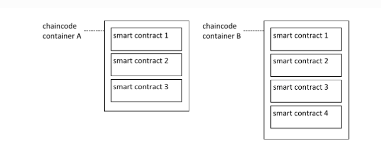

# baas调用
baas平台前端调用  ---baas后端。

baas的业务逻辑以beego框架写。

下层调用，是fabric的创建脚本以及fabric的go-sdk

## 启动网络
### 原生启动

#### 节点初始化
通过 cryptogen 脚本启动网络。或者Fabric CA启动网络。MSP文件夹包含每个身份的证书和私钥
<!-- docker 镜像启动三个节点: hyperledger/fabric-orderer:latest   hyperledger/fabric-peer:latest   -->
cryptogen generate --config=./organizations/cryptogen/crypto-config-org1.yaml --output="organizations"
cryptogen generate --config=./organizations/cryptogen/crypto-config-org2.yaml --output="organizations"
cryptogen generate --config=./organizations/cryptogen/crypto-config-orderer.yaml --output="organizations"

<!-- 一个通道，抽象来看一条链 -->
#### 创建通道
初始块：configtxgen -profile ChannelUsingBFT -outputBlock ./channel-artifacts/${CHANNEL_NAME}.block -channelID $CHANNEL_NAME
scripts/orderer.sh脚本：配置order私钥，加入通道

#### 部署链码
./network.sh deployCC -ccn basic -ccp ../asset-transfer-basic/chaincode-go -ccl go
1.先获得授权
2.链码部署到peer节点
3.链码实例化

#### 与链码交互
peer chaincode invoke 
<!-- Orderer节点的地址和端口， -->
-o localhost:7050 
<!-- 别名覆盖 -->
--ordererTLSHostnameOverride orderer.example.com 
<!-- 指定Orderer节点，ca证书 -->
--tls --cafile ${PWD}/organizations/ordererOrganizations/example.com/orderers/orderer.example.com/msp/tlscacerts/tlsca.example.com-cert.pem 
<!-- 通道名称，链码名称 -->
-C mychannel -n basic    

--peerAddresses localhost:7051 --tlsRootCertFiles ${PWD}/organizations/peerOrganizations/org1.example.com/peers/peer0.org1.example.com/tls/ca.crt 
--peerAddresses localhost:9051 --tlsRootCertFiles ${PWD}/organizations/peerOrganizations/org2.example.com/peers/peer0.org2.example.com/tls/ca.crt 
-c  '{"function":"InitLedger","Args":[]}'

### baas平台启动
选择部署网络为fabric，后续操作发送到baas-fabric服务。   由上海团队负责
选择部署网络为xsuper，后续操作发送到xsuper服务。        由北京团队负责
#### fabric接口封装
将原生启动的操作，封装并拆分为baas的多个业务接口。比如：创建联盟，创建org，加入联盟，创建通道，安装链码，实例化链码，链码升级，链码查询，链码调用等。
其中在调用创建org相关接口前的业务逻辑，大多属于配置阶段，比如：生成证书，生成config，生成创世区块的配置文件等。

#### 链码调用封装

获得服务地址，加载钱包或者已有MSP。知道对应的通道以及链码信息。调用order地址。

const { Gateway, FileSystemWallet, X509WalletMixin } = require('fabric-network');
const path = require('path');
const fs = require('fs');

async function main() {
    try {
        // 设置钱包路径
        const walletPath = path.join(process.cwd(), 'wallet');
        const wallet = new FileSystemWallet(walletPath);

        // 创建网关连接
        const gateway = new Gateway();
        await gateway.connect(
            fs.readFileSync(path.join(__dirname, 'connection-profile.json')).toString(),
            {
                wallet,
                identity: 'admin', // 使用admin身份
                discovery: { enabled: true, asLocalhost: true }
            }
        );

        // 获取网络和链码实例
        const network = await gateway.getNetwork('A通道'); // 替换为实际通道名
        const contract = network.getContract('chaincodeA'); // 替换为实际链码名

        // 调用链码方法
        const response = await contract.submitTransaction('invoke', 'a', 'b', '10'); // 替换为实际的链码方法和参数
        console.log(`Transaction has been submitted, result is: ${response.toString()}`);

        // 查询数据
        const queryResponse = await contract.evaluateTransaction('query', 'a'); // 替换为实际的查询方法和参数
        console.log(`Query result is: ${queryResponse.toString()}`);

    } catch (error) {
        console.error(`Failed to submit transaction: ${error}`);
        process.exit(1);
    }
}

main();

go
func main() {
	// 加载配置文件
	configFile := filepath.Join(os.Getenv("GOPATH"), "src/github.com/hyperledger/fabric-sdk-go/examples/fabric-samples/test-network/organizations/peerOrganizations/org1.example.com/users/Admin@org1.example.com/msp/admincerts", "connection-org1.yaml")
	configPath := config.FromFile(configFile)

	// 初始化SDK上下文
	ctx, _ := contextual.New(context.Background(), configPath)

	// 创建资源管理客户端
	resMgmtClient, err := resmgmt.New(ctx)
	if err != nil {
		fmt.Printf("Error creating resource management client: %s\n", err)
		os.Exit(1)
	}

	// 获取通道客户端
	channelClient, err := channel.New(ctx, channel.WithEventClientOpts(channel.WithBlockEvents()))
	if err != nil {
		fmt.Printf("Error creating channel client: %s\n", err)
		os.Exit(1)
	}

	// 获取通道名称
	channelName := "A通道"
invoke", "a", "b", "10

func invoke(){
	
}
	// 调用链码方法
	invokeChaincode(channelClient, channelName, "chaincodeA", "invoke", "a", "b", "10")
	// 查询链码
	queryChaincode(channelClient, channelName, "chaincodeA", "query", "a")
}

func invokeChaincode(client fab.Client, channelName string, chaincodeName string, funcName string, params ...string) {
	// 创建请求
	req := &peer.ChaincodeInvocationSpec{
		ChaincodeSpec: &peer.ChaincodeSpec{
			Type:  peer.ChaincodeSpec_GOLANG,
			ChaincodeId: &peer.ChaincodeID{
				Name: chaincodeName,
			},
			Input: &peer.ChaincodeInput{
				Args: argsToBytes(params...),
			},
		},
	}

	// 创建提案
	propReq := &fab.TransactionProposalRequest{
		ChaincodeId: chaincodeName,
		Ctx:         context.Background(),
		ChaincodeSpec: &peer.ChaincodeSpec{
			Type:  peer.ChaincodeSpec_GOLANG,
			ChaincodeId: &peer.ChaincodeID{
				Name: chaincodeName,
			},
			Input: &peer.ChaincodeInput{
				Args: argsToBytes(funcName),
			},
		},
	}

	// 发送提案
	resp, err := client.SendTransactionProposal(propReq, channelName)
	if err != nil {
		fmt.Printf("Error sending transaction proposal: %s\n", err)
		os.Exit(1)
	}

	// 提交事务
	err = client.SubmitTransaction(resp.TransactionID, resp.ChannelID, resp.EndorsedProposalResponse, resp.Proposal)
	if err != nil {
		fmt.Printf("Error submitting transaction: %s\n", err)
		os.Exit(1)
	}

	fmt.Println("Transaction submitted successfully.")
}

func queryChaincode(client fab.Client, channelName string, chaincodeName string, funcName string, params ...string) {
	// 创建请求
	req := &peer.ChaincodeInvocationSpec{
		ChaincodeSpec: &peer.ChaincodeSpec{
			Type:  peer.ChaincodeSpec_GOLANG,
			ChaincodeId: &peer.ChaincodeID{
				Name: chaincodeName,
			},
			Input: &peer.ChaincodeInput{
				Args: argsToBytes(funcName, params...),
			},
		},
	}

	// 创建提案
	propReq := &fab.TransactionProposalRequest{
		ChaincodeId: chaincodeName,
		Ctx:         context.Background(),
		ChaincodeSpec: &peer.ChaincodeSpec{
			Type:  peer.ChaincodeSpec_GOLANG,
			ChaincodeId: &peer.ChaincodeID{
				Name: chaincodeName,
			},
			Input: &peer.ChaincodeInput{
				Args: argsToBytes(funcName, params...),
			},
		},
	}

	// 发送提案
	resp, err := client.EvaluateTransaction(propReq, channelName)
	if err != nil {
		fmt.Printf("Error evaluating transaction: %s\n", err)
		os.Exit(1)
	}

	// 输出结果
	fmt.Println("Query result:", bytesToString(resp.Payload))
}

func argsToBytes(args ...string) [][]byte {
	bargs := make([][]byte, len(args))
	for i, arg := range args {
		bargs[i] = []byte(arg)
	}
	return bargs
}

func bytesToString(b []byte) string {
	return string(b)
}