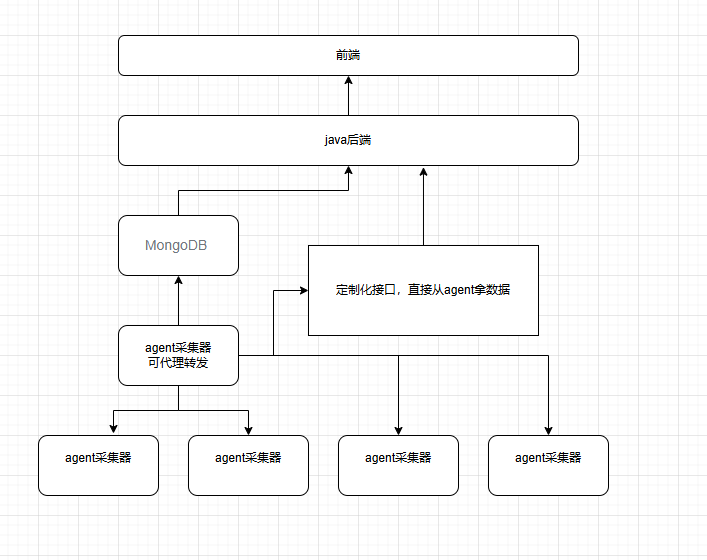

# 日志监控平台
从小米开源的监控框架，找的一个采集器。
小米--滴滴运维监控---夜莺监控
开源的夜莺框架。

## 框架：

## agent：（数据采集器）
1.配置config处理。 读取，配置容错，自动补全
配置下发。    配置下发，agent配置，agent状态，agent状态监控
2.日志处理。    日志分割，采集，备份
处理日志，用业界的方法。但是没必要。

选择特殊日志上报
3.数据采集，数据处理，数据转发

4.优化mq任务下发这一块，转发mq任务。

5.其他agent的心跳监督，健康状态检查

6.自动化更新agent

7.调研对虚拟机的监控，对容器的监控

## 业务调研
用go重写部分后端业务。
后端部分，探究docker启动。k8s运维。

