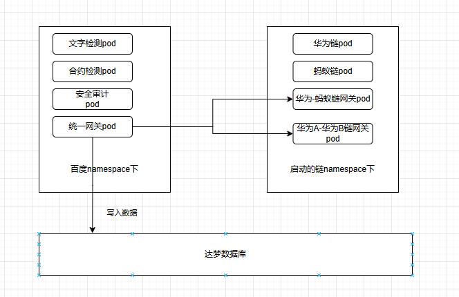
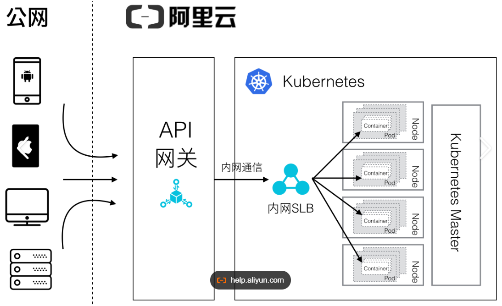
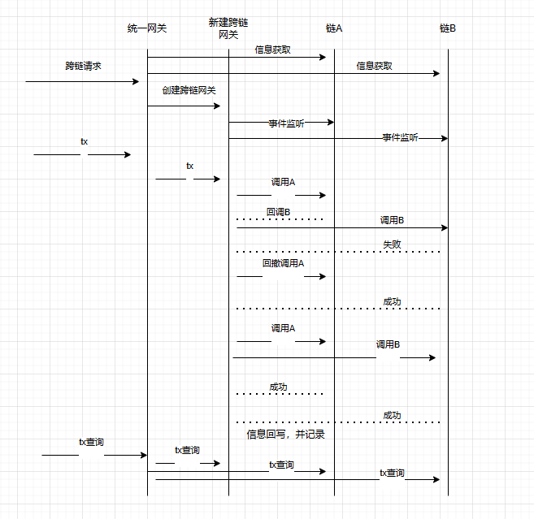
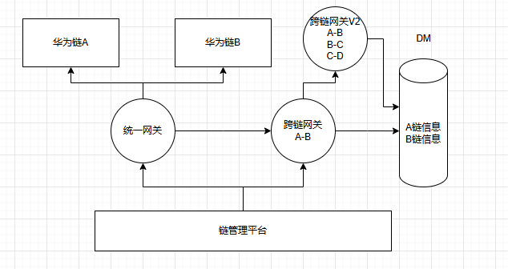
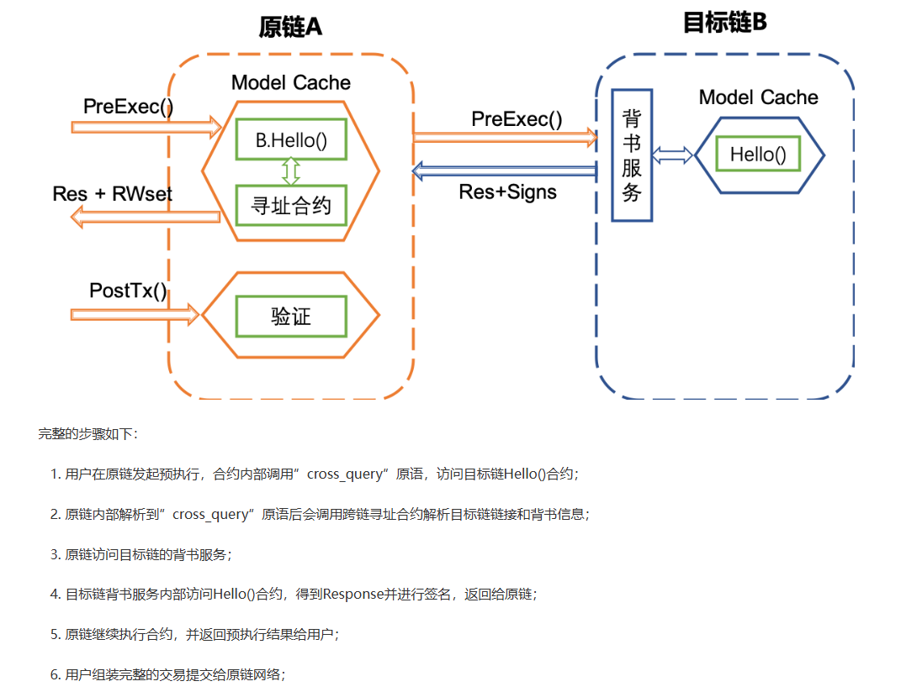
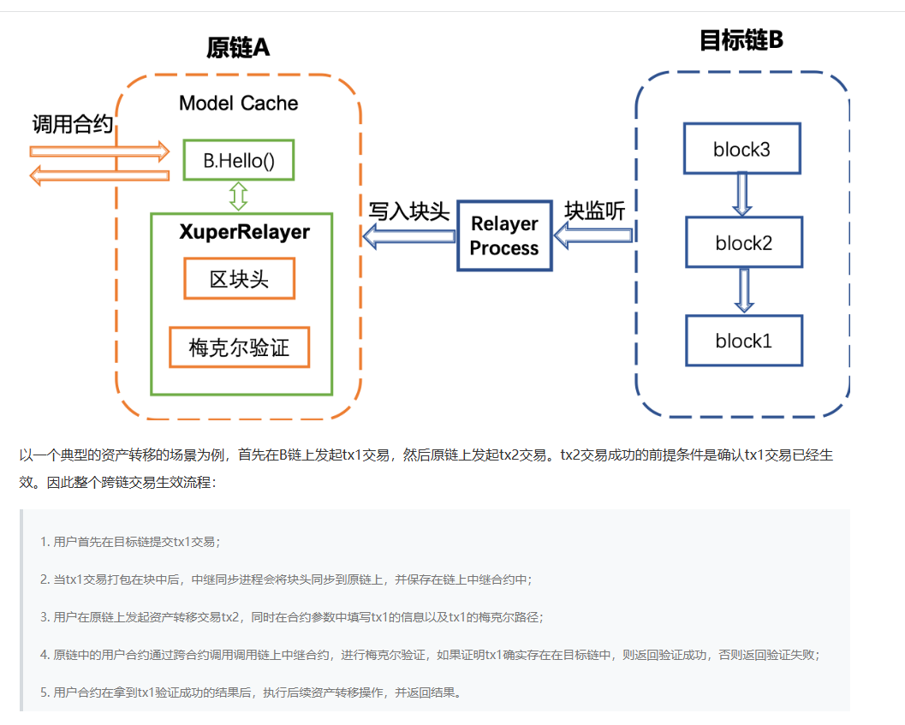

# 浦东区块链平台外包项目
3. 项目主要建设内容

项目建设主要包括区块链基础设施、区块链共性组件、应用服务器软件、分布式元数据采集、区块链监管服务平台、数据资源链、契约存证链、时间银行、电子资料链。

3.1区块链基础设施

3. 1.1区块链软件平台 ：3. 1.1.1底层链（开放） ：建设简单易用，快速验证，灵活可定制的浦东新区政务区块链软件平台。提供高性能，稳定可靠，隐私安全，多种类型数据的区块链存证能力。同时，具有高可靠性、高可运维性、高安全性和适配全球部署等优势。具有高效、便捷、可靠的智能合约编程环境，支持多种开发编程语言，提供优秀的执行效率，具有安全可靠的合约审计。加速浦东新区区块链政务业务应用开发、测试、上线，助力政府内部区块链应用快速落地以及浦东新区商业应用场景落地。

3.1.1.2底层链（信创） ：在安全、稳定、性能可靠的基础上构建浦东新区政务区块链软件平台。以区块链技术为核心，联合安全网络和可信硬件，实现软件+硬件集合。提供快速、安全的区块链端到端的解决方案。实现业务应用及数据的互备、互链、互融，为浦东新区各委办局的电子政务应用上链服务提供基础支撑。

3.1.2区块链共性组件 ：3.1.2.1统一网关 ：屏蔽底层异构区块链网络差异性，为区块链应用系统提供统一便捷的合约交互服务能力。

3.1.2.2统一合约在线编辑器 ：提供智能合约一站式多语言编辑、编译、预览、语法检测核心功能的统一在线工具。

3.1.2.3静态合约安全检测 ：提供智能合约漏洞排查工具，兼容异构区块链底链，降低由于合约编译问题而造成的区块链网络故障风险。用户只需专注智能合约的业务逻辑实现，降低开发难度，提升开发效率。

3.1.2.4安全审计 ：建立上链前信息审核、上链后信息溯源两个环节的安全管理和技术防范，保障区块链应用服务信息网络安全、可管、可控、合规。

3.1.2.5文本检测 ：文本检测是基于自然语言处理技术，用于判断一段文本是否遵循平台内容规范的一个自动化和智能化系统。文本检测利用自然语言处理技术，实现了自动化的内容违规检测和识别，减少相关人员的工作成本，同时提高政务区块链网络内容合规性。

3.1.2.6统一跨链 ：提供统一跨链服务，实现底层异构区块链网络间的数据可信共享与交换。

3.1.2.7跨链适配 ：提供中继链跨链组网适配、中继跨链直连适配、跨链合约适配、业务合约适配、跨链管理服务适配功能。

3.1.2.8统一认证授权服务平台

运用区块链不可篡改、可溯源、智能合约、可信共享等核心技术，实现个人或企业在办事过程中的统一认证授权。确保授权存证可信，过程可溯源，从而提高授权的公信力。

3.2应用服务器软件

支持主流标准规范、支持非阻塞IO、支持异常重启、支持安全协议、源码安全扫描报告、防渗透测试报告、支持访问过滤配置、提供类加载冲突检测工具、支持多种架构能力、支持HTTP 2.0协议。

3.3分布式元数据采集：对委办局的业务库进行数据探查，支持分布式元数据采集和数据源适配功能。

3.4区块链监管服务平台：建设政务区块链监管服务平台，兼容信创环境，通过统一接口适配，向下纳管底层异构区块链资源，向上为区块链应用系统提供统一而丰富的区块链服务，实现多链监管和统一服务。有效避免各行业区块链基础设施的重复建设，降低总体建设成本。并且通过统一跨链服务，保证跨链交易的安全性、可扩展性及可靠性，打破区块链数据孤岛，实现同构及异构链之间的数据可信互通。助力行业之间可信协作，促进产业生态可信融合。

3.5数据资源链

3.6契约存证链

3.7时间银行

3.8电子材料链

百度负责：
3.1.2.1统一网关 ：屏蔽底层异构区块链网络差异性，为区块链应用系统提供统一便捷的合约交互服务能力。

3.1.2.2统一合约在线编辑器 ：提供智能合约一站式多语言编辑、编译、预览、语法检测核心功能的统一在线工具。

3.1.2.3静态合约安全检测 ：提供智能合约漏洞排查工具，兼容异构区块链底链，降低由于合约编译问题而造成的区块链网络故障风险。用户只需专注智能合约的业务逻辑实现，降低开发难度，提升开发效率。

3.1.2.4安全审计 ：建立上链前信息审核、上链后信息溯源两个环节的安全管理和技术防范，保障区块链应用服务信息网络安全、可管、可控、合规。

3.1.2.5文本检测 ：文本检测是基于自然语言处理技术，用于判断一段文本是否遵循平台内容规范的一个自动化和智能化系统。文本检测利用自然语言处理技术，实现了自动化的内容违规检测和识别，减少相关人员的工作成本，同时提高政务区块链网络内容合规性。

3.1.2.6统一跨链 ：提供统一跨链服务，实现底层异构区块链网络间的数据可信共享与交换。

3.1.2.7跨链适配 ：提供中继链跨链组网适配、中继跨链直连适配、跨链合约适配、业务合约适配、跨链管理服务适配功能。

# 百度承包：
统一合约在线编辑器  静态合约安全检测  文本检测   安全审计 是百度内部文字检测（屏蔽上链信息中关于：反政府，黄，暴力）
掉接口，几天。信息处理接口。  
interface{
    静态合约安全检测sdk
    文本检测sdk
}      
## 区块链部分负责
统一跨链方案选型，跨链适配，dm数据库，pod在平台上的运维

难点：平台没有人运维，导致开发顶上去，测试工时也不多。

## 系统最终的架构

### 跨链逻辑

调用逻辑前提：所有组件启动成功
启动统一网关pod，跨链平台调用后，在统一网关pod中，调用接口，将需要跨链的链信息写入数据库。A-B。写入后以该信息启动一个pod，该pod的服务地址，即后续的跨链服务地址。

#### 初始化：
创建链 ，链连接链
跨链平台调用-->统一网关pod 

提供了一个统一网管的架构图：

交易跨链流程图

需要多链跨链

统一网关是多个pod构成的服务。比如百度跨链的服务地址：196.168.1.1:8080/crosschain    

实际上阿里的应该是 196.168.1.1:8080/creatchain。但是为了各自业务的分开，196.168.1.1:8090 

最上层做端口映射。
#### 使用
往链上写入数据，跨链平台调用-->指定链的pod  由阿里，华为提供链的创建。
跨链平台调用-->服务网关pod
跨链平台调用-->服务网关pod   跨链使用
跨链平台调用-->统一网关pod-->关闭服务网关pod-->保存数据   关闭跨链

### 跨链功能实现
<!-- fabric 自带的跨链逻辑没有使用。 invokeChaincode() API 的链码间交互 -->
服务网关pod的业务逻辑：
1.跨链服务，根据跨链平台请求，调用跨链服务，返回跨链结果。

2.监听事件，通过提供的sdk，监听链A，链B的事件   回调链n接口，等待链n的回调，判断链n的回调信息
超级链有部分跨链功能：跨链架构：

在这个基础上做更多的开发，并完善。
对资产转移的完善：

（参数的获得，这部分需要写。java）（事件监听）event listener  增加事件，增加监听

统一跨链：
组网方式：
直连1对1，A和B链交互的信息，写入数据库。（A链的网关，B链的网关）

中继：最多支持4个。A,B,C,D   （這個需求是跨链功能交付后，让新增的。不然不过验收过。）工时人力缺 3/4 确定要新增这个需求
A-B，B-C,C-D
跨链平台调用-->服务网关A-Bpod-->服务网关B-Cpod -->服务网关C-Dpod 

2个月，开发加测试

### 内容检测逻辑
没有做这部分:
跨链平台上传文本，调用接口，返回检测结果。修改内容后上链。

检测以pod形势部署
问题：pod的更新甩给了区块链部门，霞姐负责，后期我跟进。

### 达梦数据库
必须使用达梦数据库，前期调研，部署，霞姐。

在使用中出问题了，徐宏宇介入帮助处理，数据库升级，字段类型需要更新。
dm部署出问题，社区找解决方案。
出容灾文档，备份文档，恢复文档。
排查问题，难顶。搞了半个月。

缺点：没有前端交互。都是底层接口的调用。交付底层接口。

