# 浦发银行购买百度baas平台
## baas平台 霞姐负责
优化大概4人。

### 负责工作：
#### 生态链开发
感觉该需求很奇怪。
本质还是平台的联盟链。对联盟链相关配置用生态链替换，并且单独部署pod以及新建对应数据库。
2022/11 入职后，开发这个。顺便加深对baas平台了解。
测试的时候，自己写前端。并将前端部分整合到内部镜像中。

## 商业化定制
### did模块，杰哥负责

在baas平台，部署fabric国密，创建联盟链，创建组织，初始化channel，初始化did-storage链码。对外提供服务的order: 192.168.0.5:8082
前端使用did上链，通过did模块，调用fabric的go-sdk上链。

did模块是新实现，大概6人开发。
模块包括：did-manager，did-sdk-go，did-service，issuer-manager，vc-manager等。一共大概9个模块
四期交付1.0版本，5期交付2.0版本。       最终版本2.3
#### vc-manager
徐宏宇负责vc-manager模块，和杰哥一起开发，已有了基础的vc，vp查询逻辑
1.对vc签发失败的处理。（卡在application_info表失败的处理，上链成功，但未vc成功的处理，多集群失败判断，预签发失败处理等）
2.实际测试中did和vc容易对不上，对申请vc进行优化以及额外增加vc申请失败的状态。
3.增加和消息中心，浦发金融连通接口
4.对vc，vp过期的处理

开发，测试5个月。

### 接入外部公链，联盟链
与联盟链组网，百度链和浦发链组网原生支持。能给出组网方案。
追加一个和以太坊组网的方案。给出的组网方案如下：
1.部署以太坊节点，作为一个私有节点。 此方案人力不够，冷处理
2.部署合约，合约内资产对应浦发资产。测试网部署，并给相关操作文档

交付结果：交付文档，实际操作冷处理，处于安全可控思考，不与外部链接。

测试，部署2个月。

### 合约模块
在baas平台，部署fabric国密，创建联盟链，创建组织，初始化channel，初始化数字藏品链码。
徐宏宇负责，在交付后期就我一个人驻场。新增的需求需要独立完成。2023/9项目人员优化。
#### 合约的定制化：
出具相关的合约模版：电子认证合约，抽奖合约，nft合约。
给浦发金融下的模块，部署nft。并测试在以太坊测试网上部署，并交付相关文档。

开发，交付2个月

F:\编程\vc-manager

基于fabricv1.0的百度baas平台。有点更不上时代了。
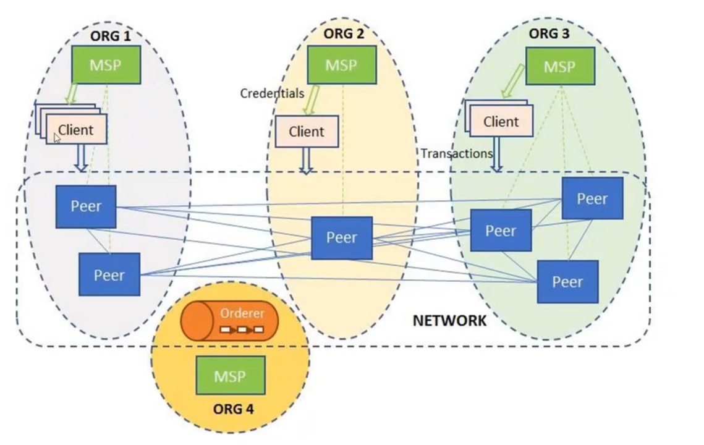

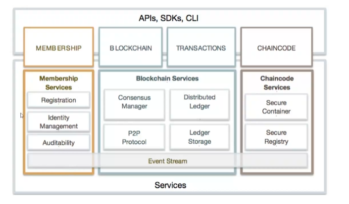

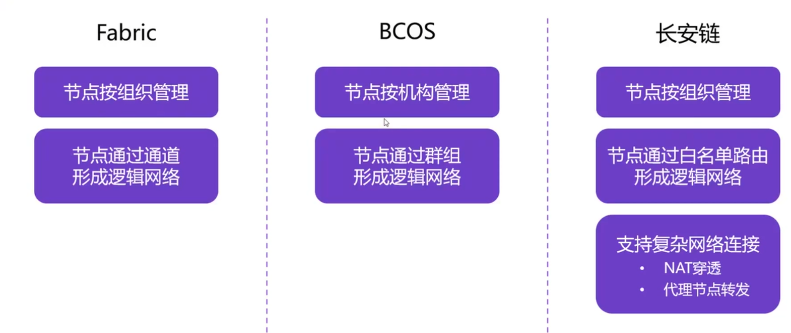

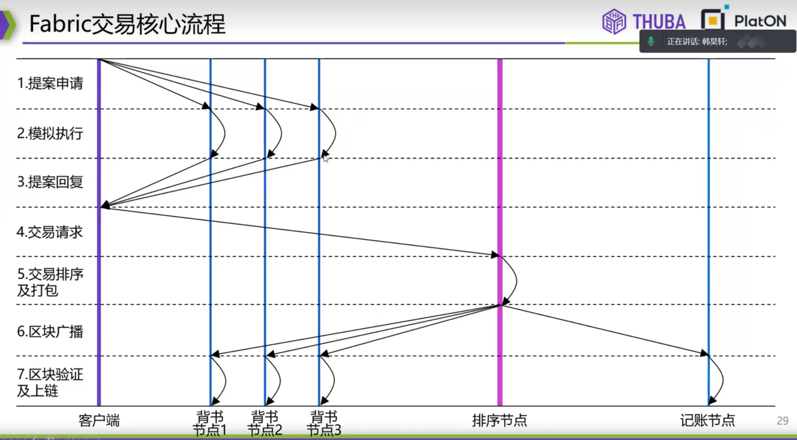

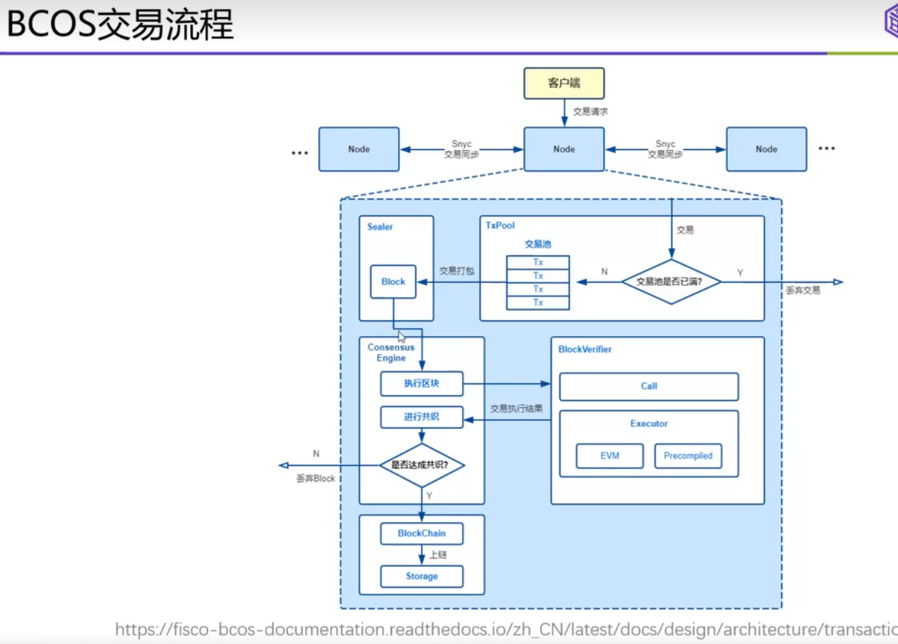

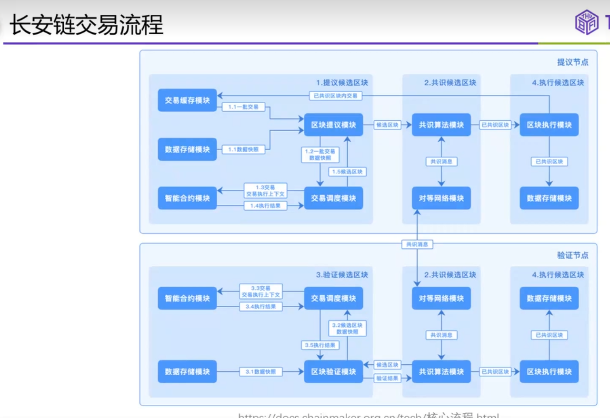

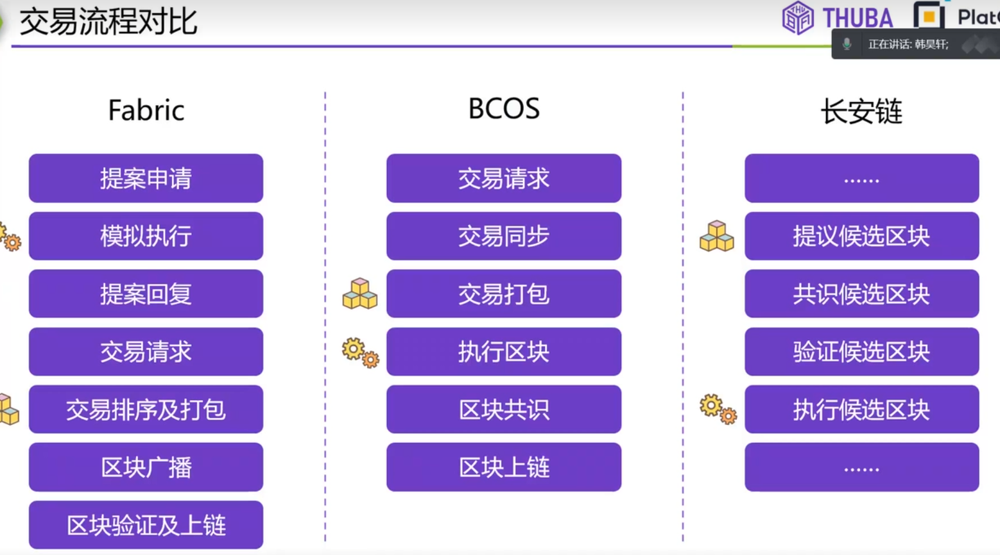

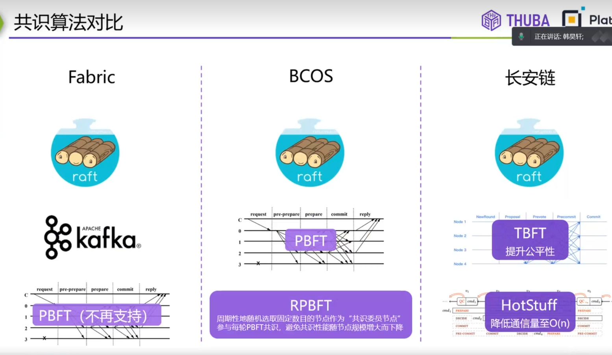

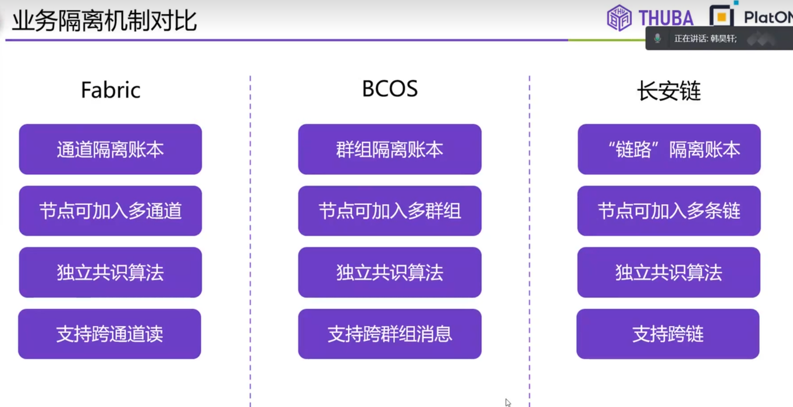

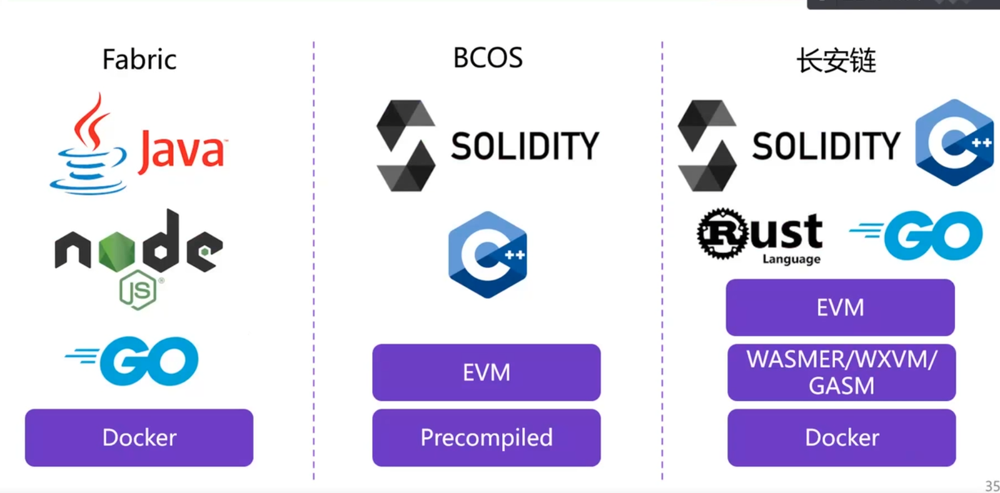

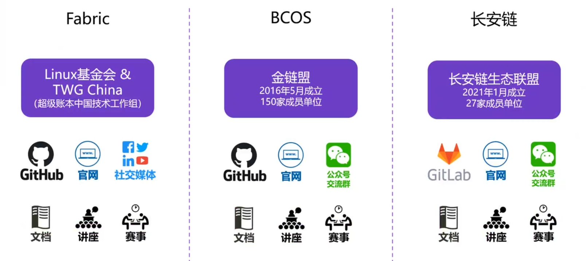

