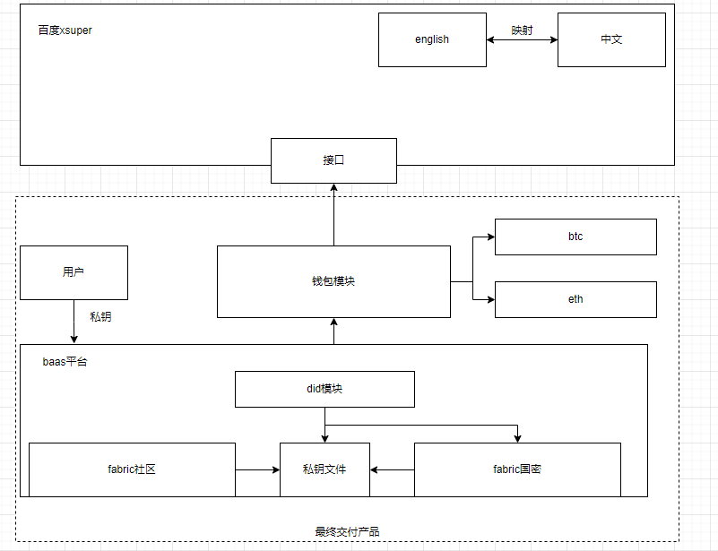

# 百度数字藏品平台，是基于baas平台上的商业平台。
工作量不多，对内部的百度数字藏品平台进行处理，希望包装为产品销售给企业。

对百度数字藏品平台代码的重写。
## 内容
肖伟对百度baas的海外化的安排，allin以太坊。
1.对solidity感兴趣的同学，帮北京进行智能合约的编写。调研nft在测试网上部署。

2.海外交易市场调研，杰哥负责。

3.百度藏品平台，跨链调研。将数字藏品移动到海外交易市场对海外的nft进行研究，并做分析。小明负责，徐宏宇后期跟进，将这些合约集成到浦发的平台

对交付浦发的项目做处理，模块化，沉淀总结已有的功能，集成到原来的baas平台。

baas平台
4.对钱包的升级，原先密钥是中文的。对fabric账户的处理，以及xsuper的账户
嵌入eth模块。

本来这个产品打算配合baas平台卖出去的，兜售了一圈，但是没有找到合适的商单，王老师继续研究。

钱包模块兼容eth和btc

钱包模块与baas平台与xsuper的架构关系

1.负责处理助记词，需要符合业界标准。
2.能不能百度自己的前端插件（）
3.浦发有个需求，想要在baas平台使用xsuper的东西，能满足不。
如果走跨链组网的逻辑，需要组网。如果是钱包逻辑

问题：后端负责钱包助记词生成有问题。
这部分转化sdk
xsuper的sdk

如果全都转为sdk，这个功能如何进行售卖。

优化：
密码学部分没动，对助记词进行了优化，通过助记词识别语言，优化助记词检索部分。以及中-英文助记词切换
根据2021版本的go-sdk，对钱包的升级。
原先逻辑
- `strength`：1弱（12个助记词），2中（18个助记词），3强（24个助记词）。
- `language`：1中文，2英文。

增加选择：
钱包 ： - `wallet`：1 xsuperwallet，2 ethwallet 3.btcwallet
- `xsuperwallet`：strength   language
- `ethwallet`：strength   language
--->调用go-eth
- `btcwallet`：strength   language
--->调用go-btc
bip39    
调用go-eth，go-btc，生成的随机商，随机商对应百度单词库，生成中文助记词或者英文助记词。
通过百度助记词，调用百度api，生成对应秘钥。

实现钱包的生成。

钱包的几个接口：
创建钱包：
1. bip39助记词生成钱包。   2.转百度助记词。   3.配合平台密码生成私钥文件   4.给用户私钥文件

baas平台导入钱包：
1.百度助记词或者私钥文件导入。

or eth wallet或者btc wallet导入。 2.私钥助记词，转bip39熵，生成百度助记词    3.配合平台密码生成私钥文件

baas平台调用钱包接口，
1. 获取用户私钥文件。 
2.调用eth，或者btc转账签名                    （有一定风险）
3.调用baas平台接口，生成交易，签名，广播交易。  （有一定风险）

缺点：链下操作，没法检查生成的账户是否已存在。       交付浦发的功能，钱包连接公链暂时禁用。没有前端，没有强调应用这个需求。

私钥文件和百度xsuper私钥文件一致，所以baas平台可以调用xsuper转账签名。     已交付功能，但是需要浦发在xsuper上注册充值。

bip44 秘钥派生  基于这个升级

- 私钥存储        已解决
- 与节点或api服务器的通信：         少量查询，走开发账户的接口。大量查询后期再看。
    1.查询余额                     
    2.查询构造交易的必要参数（btc 为utxo, eth 为交易计数）
    3.广播交易
    4.查询交易

5.登陆鉴权模块。
ak,sk.
在登录的时候，先调用baas的登录接口，拿到ak,sk。再调用鉴权接口，拿到token。
若过期，或者未登陆。路由中间层跳转登陆页面。

屏蔽无权限的接口
没权限，权限提示。   

这部分封装为钱包模块。放到baas平台，作为售卖点。