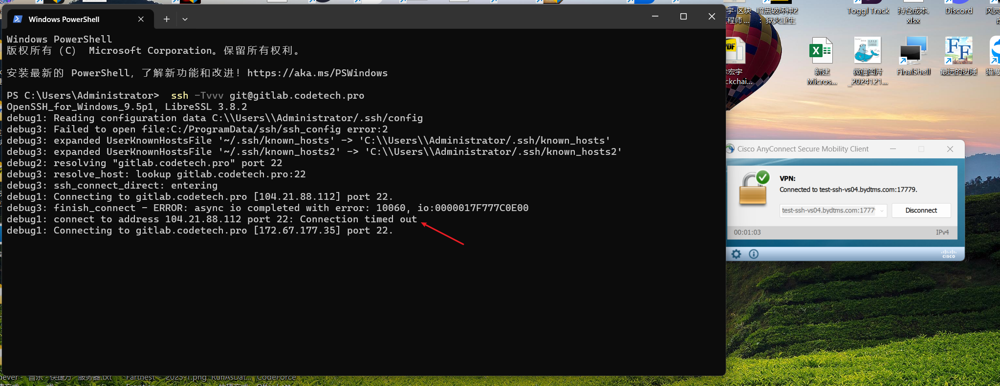

 git config --global user.email "845256503@qq.com"

 172.67.177.35

测试连接git
 ssh -Tvvv git@gitlab.codetech.pro

 git config --global user.name "larry"
 git config --global user.email "larry@codeforce.tech"