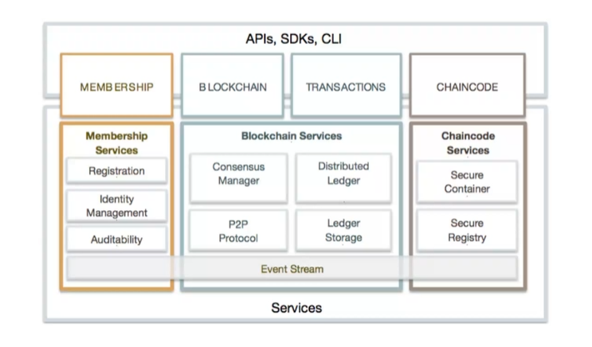
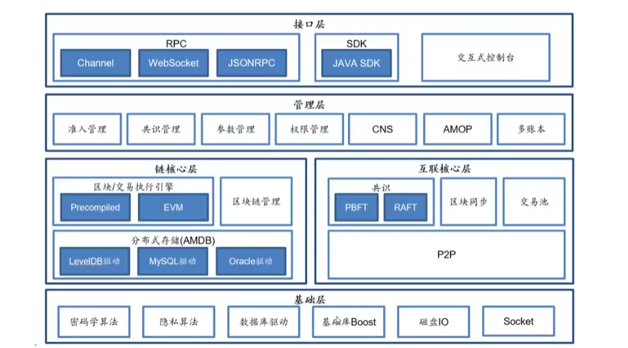
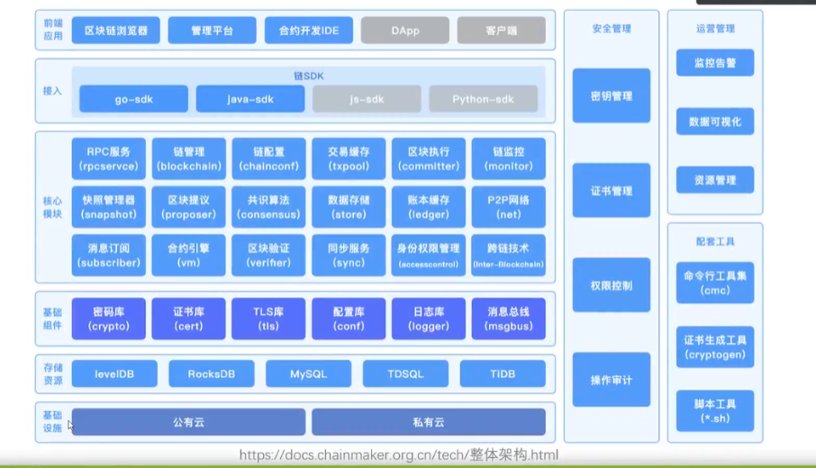

## 联盟链对比
fabric系统架构

bcos系统架构

长安链系统架构

## 模块分析
区块链模块：
fabric提出的账本模式，区块链文件。优化是世界状态数据库。保存当前账户余额、合同条款等实时状态信息，为了提高查询效率，这部分通常由键值对数据库（如 LevelDB 或 CouchDB）实现。
bcos提出的区块链数据结构传统，高性能。区块链文件加状态数据库：使用键值对存储的方式保存账户状态和其他智能合约的数据。
长安链：分布式存储，都能实现。将这个拆分为了一个可变模块

共识机制的选型：

节点加入网络

交易上链的流程

