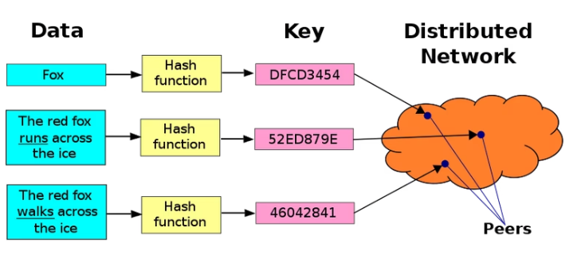

## ipfs get
现在考虑另一个问题，我们常见的图像为.jpg、.png，而常见的视频则是.mp4一样，可以直接从后缀名判断文件类型。通过 IPFS 上传的文件也可以是多种类型，也包含了很多信息，怎么进行分辨呢？

IPFS 早期主要使用base58btc对multihash进行编码，但是在开发 IPLD（主要用来定义数据，给数据建模）的过程中会遇到很多与格式相关的问题，因此使用了一种叫CID的文件寻址格式来对不同格式的数据进行管理，官方的定义为：

CID是一种自描述式的内容寻址的识别符，必须使用加密散列函数来得到内容的地址

简单来说，CID通过一些机制来对文件所包含的内容进行自描述，包含了版本信息、格式等。
目前CID有v0和v1两种版本，v1版本的CID由V1Builder生成

<cidv1> ::= <mb><version><mcp><mh>
# or, expanded:
<cidv1> ::= <multibase-prefix><cid-version><multicodec-packed-content-type><multihash-content-address>