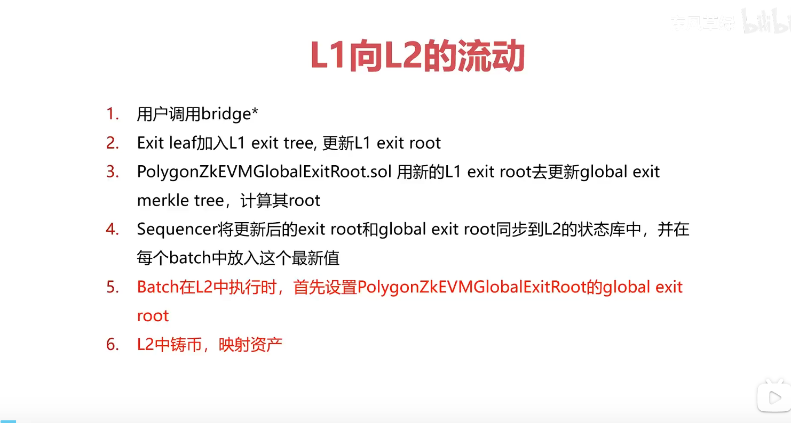

## zk构造

struct BatchData {
    bytes transactions;
    bytes32 globalExitRoot;
    uint64 timestamp;
    uint64 minForcedTimestamp;
}
BatchData打包成为Batches，然后对其处理verifyBatches 以及顺序处理sequenceBatches 。
这个函数会对全局退出根进行相应的操作，其内部可能会基于当前 L2 网络中的交易、资金流动、批次处理等情况综合计算并更新全局退出根的值。

_verifyAndRewardBatches 函数构建起了严谨且完整的批次验证与奖励发放逻辑链条，通过细致的状态根获取与检查、零知识证明验证以及合理的奖励计算与发放等环节，保障了 L2 网络中批次验证流程的准确性、可靠性以及对聚合器参与验证的有效激励。

verifyBatchesTrustedAggregator 函数为受信任聚合器提供了一套完整的批次验证流程，涵盖验证与奖励发放、状态合并清理、与外部模块交互以及事件通知等关键环节，对于保障 L2 网络在受信任聚合器参与下交易批次经过验证后状态正确更新以及整个网络的有序、安全运转起着重要作用。

overridePendingState 该函数的主要目的是允许受信任的聚合器（trustedAggregator）在满足特定条件下覆盖未决状态（pending state）。实现对未决状态的特殊处理，这体现了受信任聚合器在网络状态管理方面拥有的一种特殊权限和操作能力，有助于在特定复杂情况下灵活调整网络状态，保障网络的正常运行和数据一致性。

#  全局退出根
退出根是用于验证跨链操作（如资产转移、消息传递等）合法性以及确保网络间状态一致性的重要标识，通过对其管理，能够为整个跨链生态系统提供准确的状态参考，保障跨链交互的安全与有序进行。
## 合约关键属性说明：
bridgeAddress：类型为 address，且被声明为 immutable（不可变），代表 PolygonZkEVMBridge 合约的地址，这是在跨链交互中与本合约紧密相关的另一个重要合约，后续很多操作（如更新退出根）会基于该地址进行权限判断等，且其不可变性保证了与之关联的重要逻辑的稳定性。
rollupAddress：同样是 address 类型的不可变变量，指向 Rollup 合约地址，Rollup 合约在处理交易批次等操作时与退出根更新密切相关，比如每批次验证通过后会更新相应的退出根，该地址的不可变设定保障了相关业务逻辑的基础配置稳定性。
lastRollupExitRoot：bytes32 类型，用于存储 Rollup 网络的最后退出根，会随着 Rollup 相关批次的验证情况动态更新，是反映 Rollup 网络当前状态的关键指标，为后续计算全局退出根等操作提供基础数据。
lastMainnetExitRoot：也是 bytes32 类型，记录主网（mainnet）的最后退出根，每当主网有新的存款操作等情况发生时会进行更新，同样作为计算全局退出根以及验证跨链操作与主网状态关联的重要依据。
globalExitRootMap：这是一个映射（mapping）类型，以 bytes32 类型的退出根作为键，uint256 类型的时间戳作为值，用于存储每个全局退出根对应的生成时间戳，方便后续查询某个全局退出根的时效性以及判断其是否有效等操作，在整个退出根管理体系中起着记录和验证时间维度信息的重要作用。

总体而言，PolygonZkEVMGlobalExitRoot 合约构建起了一套围绕主网和 Rollup 网络退出根管理的完整机制，涵盖更新、存储记录以及查询获取等功能，通过合理的权限控制、与相关合约的协同以及基于时间戳的状态管理，为基于 Polygon ZkEVM 的跨链生态系统提供了重要的全局退出根管理服务，保障跨链交互在网络状态验证等方面的准确性和安全性。
### 
无论是在更新退出根还是获取最后全局退出根的操作中，都依赖 GlobalExitRootLib 库中的 calculateGlobalExitRoot 函数来计算全局退出根。这种统一的计算逻辑确保了在任何时候，只要给定主网和 Rollup 网络对应的退出根（lastMainnetExitRoot 和 lastRollupExitRoot），都能按照一致且预先定义好的规则生成全局退出根。例如，按照特定的密码学算法或者数据组合方式将两者整合计算，使得全局退出根能准确反映两个关键网络的整体状态，为跨链交互提供了一个统一、可靠的状态验证标识，避免因计算规则不一致导致不同节点对跨链状态判断出现差异，保障跨链操作在统一的状态认知下安全有序进行。
比如在跨链验证环节可以判断某个全局退出根是否是最新有效的，防止使用过期或者被篡改的旧全局退出根进行跨链操作；另一方面，通过时间顺序可以梳理出全局退出根的更新历史，方便追溯跨链交互过程中不同阶段的状态变化情况，有助于排查可能出现的问题以及确保跨链操作严格按照时间先后顺序基于正确的状态推进，增强了跨链交互的有序性和可追溯性。

## 导致全局退出根的更新
1. 通过 PolygonZkEVMBridge 合约发起的相关操作
当 PolygonZkEVMBridge 合约执行特定业务逻辑且涉及主网状态变更时，会触发全局退出根的更新。例如在 PolygonZkEVMBridge 合约的 bridgeAsset 函数（用于跨链资产转移）或 bridgeMessage 函数（用于跨链消息传递）等操作中，如果满足一定条件（比如在资产转移时涉及新的主网存款等情况），并且这些操作执行到需要更新全局退出根的逻辑环节时，就会调用 PolygonZkEVMGlobalExitRoot 合约的 updateExitRoot 函数来更新全局退出根。
2. 基于 Rollup 合约相关批次验证后的操作

## 跨链过程

l1的离开树，全局离开树，l2的离开树

