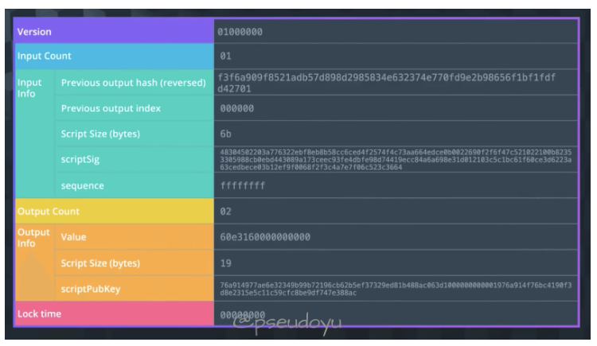

# 全节点，轻节点
## 全节点
Bitcoin Core客户端就是一个全节点，下文也会具体讲述。全节点一直在线，维护着完整的区块链信息；因为其内存里维护着完整的UTXO集合，所以通过验证整个区块链的区块和交易信息（从创世区块到最新区块）来验证交易的合法性；也会决定哪些交易会被打包到区块中；验证交易即挖矿，可以决定沿着哪条链继续挖，在出现等长的分叉时，也会选择哪一个分叉；同时监听别的矿工挖出来的区块，验证合法性。

## 轻节点

轻节点不需要一直在线，也不需要保留整个区块链（数据量庞大），只需要保留每个区块的块头；且只需要保存与自己有关的区块，而不需要保存链上全部交易；因为并没有保存全部信息，无法验证大多数交易的合法性和网上发布的新区块的正确性，只能检验与自己有关的区块；可以通过Merkle Proof验证一笔交易存在，但不能确认一笔交易不存在；可以验证挖矿的难度，因为保存在块头中。

### 验证的区别
下面通过一个示例来讲解一下全节点和轻节点的交易验证方式。

假如要验证一个位于 block 300,000 的交易 T，全节点会查验全部 300,000 个区块（直到创世区块），建立一个完整UTXO的数据库来确保这个交易没有被花费；而轻节点则会通过Merkle Path来链接所有和交易 T 相关的区块，然后等待 300,001 至 300,006 个区块来进行确认，从而验证交易的合法性。

额外的数据库存储，就可以不需要后续确认。

### 轻节点快速校验
因为轻节点（例如手机上的比特币钱包）不保存整个区块链数据，通过Merkle Tree结构可以很方便地查找交易，轻节点会构造一个Bloom filter布隆过滤器来得到与自身相关的交易：

首先，初始化布隆过滤器为空值，获取钱包中的所有地址，创建一个检索模式来匹配与这个交易输出相关的地址，将检索模式加入布隆过滤器；
然后布隆过滤器被发送至各个节点（通过filterload消息）；
节点收到后会发送一个包含符合条件的区块头和符合交易的Merkle Path的merkleblock消息和一个包含过滤结果的tx消息。
过程中，轻节点会使用Merkle Path来链接交易与区块，并通过区块头来组成区块链，从而能够验证交易存在于区块链中。

使用布隆过滤器会返回符合筛选条件的结果，也会存在着一些误报，因此返回了很多不相关的结果，也能够在轻节点向其他节点请求相关地址时保护了隐私性。

## 区块链的结构
区块链是由顺序链接起来的区块组成的一种数据结构，可以存于单文件或者数据库中，Bitcoin Client使用 Google 的LevelDB数据库存储数据。每一个区块都指向前一个区块，任何一个区块进行了修改的话，其所有后面的区块都会受到影响，所以想要篡改一个区块的话需要同时篡改之后的所有区块，这需要大量的算力，往往成本大于收益，因此极大地保障了安全性。

区块链结构包含区块Block Size (4 bytes)、Block Header、Transaction Counter(1-9 bytes)和Transaction几个核心组成部分。

区块链的块头大小为 80 bytes，存储着Version(4 bytes)、Previous Block Hash(32 bytes)、Merkle Tree Root(32 bytes)、Timestamp(4 bytes)、Difficulty Target(4 bytes)和Nonce(4 bytes)。

每一个区块的哈希值通过对区块头进行两次哈希运算，即SHA256(SHA256(Block Header))，并不存在区块链结构中，而是由每个节点接收到区块后计算得到，是独一无二的；此外，Block Height也可以作为区块的标识符。

## btc钱包  地址生成
作为一个数字货币系统，比特币有自己的钱包系统，主要由私钥、公钥和钱包地址三个部分组成。

生成钱包地址的过程如下：

采用ECDSA(Elliptic Curve Digital Signature Algorithm)椭圆曲线算法，利用私钥生成对应的公钥
公钥很长且难以输入和记忆，因此再通过SHA256和RIPEMD160算法得到一个公钥哈希值
最后再用Base58Check进行处理，得到一个可读性较强的钱包地址

### bip协议
BIP-32：定义了 HD 钱包的标准。
BIP-39：定义了助记词的标准。
BIP-44：定义了多账户层次结构的标准。
BIP-49：定义了 P2SH 地址的派生路径。
BIP-84：定义了 P2WPKH 地址的派生路径。
BIP-173：定义了 Bech32 地址格式。
BIP-32：Hierarchical Deterministic Wallets (HD Wallets)
描述：BIP-32 定义了层次确定性（Hierarchical Deterministic，简称 HD）钱包的标准。HD 钱包允许从一个种子（seed）派生出多个私钥和对应的公钥，从而生成多个比特币地址。这种层次结构使得用户可以在不暴露主私钥的情况下生成和管理多个地址。
用途：适用于需要管理大量地址的场景，如交易所、钱包应用等。
BIP-39：Mnemonic Code for Generating Deterministic Keys
描述：BIP-39 定义了一种将随机生成的种子转换为助记词（mnemonic code）的方法。助记词是一组易于记忆的单词，用户可以通过这些单词恢复其私钥和对应的比特币地址。
用途：提供了用户友好的方式来备份和恢复私钥，避免了直接存储和管理复杂的随机数。
BIP-44：Multi-Account Hierarchy for Deterministic Wallets
描述：BIP-44 是 BIP-32 的扩展，定义了一种多账户层次结构。它提供了一种标准化的方式来组织和管理不同类型的地址，如不同币种、不同用途的地址。
路径格式：m / purpose' / coin_type' / account' / change / address_index
m：根节点
purpose'：目的，默认为44'
coin_type'：币种标识，默认为0'（比特币） 
比特币（BTC）：0'
以太坊（ETH）：60'
莱特币（LTC）：2'
比特币现金（BCH）：145'
狗狗币（DOGE）：3'
account'：账户编号
change：0 表示外部链（用于接收地址），1 表示内部链（用于找零地址）
address_index：地址索引
BIP-49：Derivation path for P2SH-BIP44 addresses
描述：BIP-49 是 BIP-44 的扩展，用于生成 P2SH（Pay-to-Script-Hash）地址。P2SH 地址通常用于支持更复杂的脚本，如多重签名地址。
路径格式：m / 49' / coin_type' / account' / change / address_index
BIP-84：Derivation path for P2WPKH addresses in native segwit
描述：BIP-84 是 BIP-44 的扩展，用于生成 P2WPKH（Pay-to-Witness-Public-Key-Hash）地址。P2WPKH 地址是 SegWit（隔离见证）地址的一种，可以提高交易效率和安全性。
路径格式：m / 84' / coin_type' / account' / change / address_index

## btc 交易过程
交易过程 #
有了钱包（和资产）后，就可以开始交易了。我们来通过一个典型的比特币交易来理解这一流程：

A 和 B 都拥有一个比特币钱包地址（可以用 Bitcoin Client 生成，原理如上），假设 A 要给 B 转账 5 个 BTC，A 需要得到 B 的钱包地址，然后用自己的私钥对A->B转账5个BTC这笔交易签名（因为 A 的私钥仅有自己知道，所以拥有私钥则是拥有钱包资产的归属权）；然后发布这笔交易，在比特币系统中发起交易需要支付小额矿工费作为交易手续费；矿工会开始验证这笔交易的合法性，得到六个确认后交易就可以被比特币账本所接受，整个验证过程大约 10 分钟。
所有的转账都是UTXO模型。就是输入UTXO，输出也为UTXO

输出需要拥有对方的公钥，或者公钥哈希，方便以后验证输出脚本。
这个公钥希望是设置的新账户公钥。次部分是bip44升级的要点。

### 矿工验证
找到所有UTXO，相加。这里可以用数据库。
#### 交易参数解释

如图，最开始的部分是Version，表示版本。

然后是 Input 相关的信息：Input Count表示数量，Input Info表示输入的内容，也就是Unlocking Script，主要用于核对输入来源、输入是否可用以及其他输入的细节。

Previous output hash - 所有输入都能追溯回一个输出，这指向包含将在该输入中花费的 UTXO，该 UTXO 的哈希值在这里以相反的顺序保存
Previous output index - 一个交易可以有多个由它们的索引号引用的UTXO，第一个索引是 0
Unlocking Script Size - Unlocking Script的字节大小
Unlocking Script - 满足UTXO Unlocking Script的哈希
Sequence Number - 默认为ffffffff
接着是 Output 相关的信息，Output Count表示数量，Output Info表示输出的内容，也就是Locking Script,主要用于记录输出了多少比特币，未来支出的条件以及输出的细节。

Amount - 以 Satoshis(最小的比特币单位)表示的输出比特币数量，10^8 Satoshis = 1 比特币
Locking Script Size - 这是 Locking Script 的字节大小
Locking Script - 这是 Locking Script 的哈希，它指定了使用此输出必须满足的条件
最后是Locktime，表示一个交易可以被最早添加到区块链的时间/块，如果小于 500 million 的话直接读取块高度，而如果大于 500 million 则读取时间戳。

接着是 Output 相关的信息，Output Count表示数量，Output Info表示输出的内容，也就是Locking Script,主要用于记录输出了多少比特币，未来支出的条件以及输出的细节。

Amount - 以 Satoshis(最小的比特币单位)表示的输出比特币数量，10^8 Satoshis = 1 比特币
Locking Script Size - 这是 Locking Script 的字节大小
Locking Script - 这是 Locking Script 的哈希，它指定了使用此输出必须满足的条件
最后是Locktime，表示一个交易可以被最早添加到区块链的时间/块，如果小于 500 million 的话直接读取块高度，而如果大于 500 million 则读取时间戳。

#### 比特币脚本
在交易中有提到Unlocking script和Locking script，那什么是比特币脚本呢？

比特币脚本是记录在每个交易中的指令列表，当脚本被执行时可以检验交易是否有效、比特币是否可以使用等。一个典型的脚本如下

<sig> <pubKey> OP_DUP OP_HASH160 <pubKeyHash> OP_EQUALVERIFY OP_CHECKSIG
比特币脚本是基于栈从左至右执行的，使用Opcodes对数据进行操作，在上面这个脚本语言中，<>包含的是要被推入 stack 的数据，没有<>包括、以 OP_ 为前缀的是操作符（OP 可省略），脚本也可以嵌入数据永久记录在链上（不超过 40 bytes），所记录的数据不会影响UTXO。

在交易中，<sig> <pubKey>是Unlocking script，OP_DUP OP_HASH160 <pubKeyHash> OP_EQUALVERIFY OP_CHECKSIG部分是Locking script。

跟大多数编程语言相比，比特币脚本是非图灵完备的，没有循环或复杂的流程控制，执行起来很简单，不论在哪里执行结果都是确定性的，也不会保存状态，且脚本与脚本之间是相互独立的。因为以上特征，虽然比特币脚本相对安全，但没办法处理很复杂的逻辑，因此不适合用来处理一些复杂的业务，Ethereum所提供的智能合约就在这一点上实现了创新性的突破，因此诞生了很多去中心化应用。

## 客户端
Bitcoin Core 客户端 #
Bitcoin Core是比特币的实现，又被称为Bitcoin-QT或Satoshi-client，可以通过这个客户端连接至比特币网络、验证区块链、发送与接收比特币等。有Mainnet、Testnet和Regnet三个网络，可以进行切换。

提供了一个Debug Console来与比特币区块链直接进行交互，常见操作如下：

Blockchain

getblockchaininfo: 返回有关区块链处理的各种状态信息
getblockcount: 返回区块链中的块数
verifychain: 验证区块链数据库
Hash

getblockhash: 返回所提供的区块哈希值
getnetworkhashps: 基于指定数量的最近块，返回每秒网络哈希数
getbestblockhash: 返回最佳块的哈希值
Blocks

getblock: 返回块信息的详细信息
getblockheader: 返回有关区块头信息
generate: 立即将指定数量的块挖矿到钱包中的一个地址
Wallet

getwalletinfo: 返回一个对象，该对象包含有关钱包状态的各种信息
listwallets: 返回当前加载的钱包列表
walletpassphrasechange: 更改钱包密码
Mempool

getmempoolinfo: 返回内存池活动状态的详细信息
getrawmempool: 返回内存池中的所有交易详细信息
getmempoolentry: 返回给定交易的内存池数据
Transaction

getchaintxstats: 计算关于链中交易总数和速率的统计数据
getrawtransaction: 返回原始交易数据
listtransactions: 返回给定帐户的交易列表
Signature

signrawtransaction: 签署原始交易的输入
signmessage: 使用地址的私钥对信息进行签名
dumpprivkey: 获取私钥
Network

getnetworkinfo: 返回 P2P 网络的状态信息
getpeerinfo: 返回每个连接网络节点的数据
getconnectioncount: 返回节点的连接数
Mining

getmininginfo: 返回包含挖掘相关信息的对象
getblocktemplate: 返回构造块所需的数据
prioritisetransaction: 以较高或较低的优先级接受交易进入挖掘的块

btc理解：
UTXO模型，未花费输出。

对金额是上锁的，解锁脚本。

对脚本的解锁，可以是几种形式。
1.给出公钥，就是P2pub2.给出公钥哈希 3.给出多签脚本 4.给出脚本哈希 