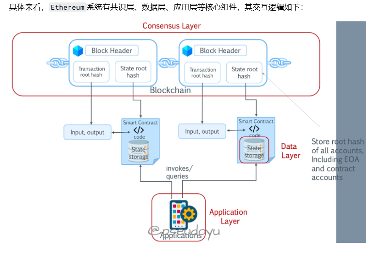

# 账户
账户 #
当我们需要登录一个网站或系统（比如邮箱）时，往往需要一个帐号和一个密码，密码通过加密算法以暗文的形式存储在中心化的数据库中。然而，以太坊是一个去中心化的系统，那是怎么生成账户的呢？

和比特币系统原理类似

首先生成一个仅有自己知道的私钥，假设为sk，采用ECDSA(Elliptic Curve Digital Signature Algorithm)椭圆曲线算法生成对应的公钥pk
采用keccak256算法对公钥pk求哈希值
截取后 160 位作为以太坊的地址
存储和管理Ethereum账户的软件/插件称为钱包，提供了诸如交易签名、余额管理等功能。钱包生成主要有两种方式，非确定性随机生成或根据随机种子生成。

## Gas
Ethereum网络上的操作也需要“手续费”，称为Gas，在区块链上部署智能合约以及转账都需要消耗一定单位的Gas，这也是鼓励矿工参与Ethereum网络建设的激励机制，从而使整个网络更加安全、可靠。

每个交易都可以设置相应的Gas量和Gas的价格，设置较高的Gas费则往往矿工会更快处理你的交易，但为了预防交易多次执行消耗大量Gas费，可以通过Gas Limit来设置限制。Gas相关信息可以通过 Ethereum Gas Tracker 工具进行查询。
eip155
降低交易费用波动：通过引入一个动态的基础费用（base fee），使交易费用更加稳定，减少用户在高峰期支付高昂费用的情况。
提高用户体验：让用户更容易预测和管理交易费用。
改善网络拥堵：通过调整基础费用，鼓励用户在网络拥堵时延迟交易，从而平滑网络负载。
销毁部分交易费用：通过销毁基础费用，减少以太坊的供应量，对抗通货膨胀

## sol 合约示例

## 交易
交易 #
在Ethereum中，一个典型的交易是怎么样的呢？

开发者部署智能合约至区块链
DApp 实例化合约、传入相应值以执行合约
DApp 对交易进行数字签名
本地对交易进行验证
广播交易至网络中
矿工节点接收交易并进行验证
矿工节点确认可信区块后广播至网络中
本地节点与网络进行同步，接收新区块

Ethereum采用的是一种Order - Execute - Validate - Update State的系统架构。在这种架构下，当产生一笔新的交易，矿工会进行PoW工作量证明机制的运算；验证完成后，将区块通过gossip协议广播至网络中；网络中的其他节点接收到新区块后，也会对区块进行验证；最终，提交至区块链，更新状态。

如上图所示，Ethereum数据由Transaction Root和State Root组成。Transaction Root是所有交易组成的树，包含From、To、Data、Value、Gas Limit和Gas Price；而State Root则是所有账户组成的树，包含Address、Code、Storage、Balance和Nonce。

## 以太坊状态树。
交易树，收据树，世界状态树

## 客户端
现在pos，以共识端和执行端。双客户端

## eth2.0变动  

### pos    奖励机制设计，验证监督设计
#### 引进：信标链
在当前的以太坊网络中只有一条链，每个以太坊节点都与这条单一的链通信。然而，一旦分片上线，主网上就会有许多不同的区块链 (即分片链)，它们相互并行工作着。信标链起支配作用，确保网络中的每个分片同步相同的信息与数据——它为所有分片链提供共识。

如前所述，验证者可以验证交易，并且如果他们被选择，也可以提议新的分片区块。如果没有被选择提议新区块，验证者的工作是确保已被提议的区块无异常——对已提议的分片区块进行验证或证明。

共识是如何形成的？
至少需要128名验证者验证每个分片区块，这群验证者组成一个委员会。而提议以及验证每个分片区块的时帧为一个slot。该委员会每次对32个slot进行提议以及验证区块，合起来为一个epoch，之后该委员会将被解散，并将选出一组新的验证者。这样做是为了让恶意验证者无法控制新一组提议区块的最终结果。

当一个提议的分片区块从委员会中获得了足够的证明，交联 (crosslink) 将向信标链共享分片的状态，包括新区块以及其交易数据。

信标链的作用是什么？
信标链记录着上述全过程的所有事情，给分片区块提议者奖励ETH，并对作恶者进行惩罚 (即罚没)。当区块准备就绪且一切都运行良好时，仍然需要对其进行敲定，以防止作恶者对其进行复原。

信标链区块也被敲定之后，则认为分片区块已被敲定。完成此操作之后，其他分片将能够读取与该分片区块相关的数据

通过上海升级，目前是采用pos。     
 
###   分片  
将数据和计算分开。因为二层扩容技术发展比较快。这部分放弃了。

### 二层扩容
以太坊使用二层网络（也称为“卷叠”）进行扩展，卷叠批量处理交易并将结果发送到以太坊上。 尽管卷叠比以太坊主网便宜多达八倍，但还可以进一步优化，以降低最终用户的成本。 卷叠还依赖于一些中心化的组件，随着卷叠的成熟，开发者可以逐步移除这些组件。

交易费

目前，卷叠比以太坊一层网络便宜大约 5-20 倍
零知识卷叠将很快把费用降低约 40-100 倍
即将进行的以太坊变更会再次扩容 100-1000 倍
用户将从中受益，交易成本降至不足 0.001 美元

二层扩容的数据处理
Proto-Danksharding
过去卷叠数据永久存储在以太坊上，这导致费用高昂。 用户在卷叠中支付的超过 90% 的交易费用是由于这种数据存储造成的。 为了减少交易费用，我们可以将数据转移到新的临时“二进制大对象”中存储。 由于二进制大对象不是永久性存储，所以相对便宜。一旦不再需要这些数据，可以将它们从以太坊中删除。 长期存储卷叠数据成为需要者的责任，例如卷叠运营者、交易所、索引服务等。 向以太坊添加数据块交易是被称作“Proto-Danksharding”的升级的一部分。

使用 Proto-Danksharding，可以向以太坊区块中添加许多二进制大对象。 这会进一步大幅（>100 倍）提高以太坊吞吐量、降低交易费用。

Danksharding
扩展二进制大对象数据的第二阶段非常复杂，因为它需要以新的方式检查卷叠数据在网络上的可用性，并依赖验证者来分离他们的区块构建和区块提议责任。 同时，它还需要以一种加密方式证明验证者已验证二进制大对象数据的小子集。

这个第二步名为“Danksharding”。 它可能需要几年时间才能完全实现。 Danksharding 依赖于其他开发工作，例如分离区块构建和区块提出，以及进行新网络设计，让网络能够通过一次性随机采样少许千字节数据即可高效确认数据可用性，这称为“数据可用性采样 (DAS)”。

#### 乐观卷积   
乐观卷叠是一种扩容以太坊的方法，涉及将计算和状态存储移至链下。 乐观卷叠在以太坊之外执行交易，但将交易数据以 calldata 或二进制大对象的形式发布到主网。

乐观卷叠运营商将多个链下交易大批量捆绑在一起，然后再提交到以太坊。 这种方法可以将固定成本分散到每批中的多笔交易中，从而降低最终用户的费用。 乐观卷叠还使用压缩技术来减少发布在以太坊上的数据量。

乐观卷叠被认为是“乐观的”，因为它们假设链下交易是有效的，并且不发布推送到链上的交易批次的有效性证明。 这一点将乐观卷叠与零知识卷叠区分开来，后者会发布链下交易的加密有效性证明。

相反，乐观卷叠依赖于欺诈证明方案来检测交易计算不正确的情况。 在以太坊上提交卷叠批次后，有一个时间窗口（称为挑战期），在此期间任何人都可以通过计算欺诈证明来挑战卷叠交易的结果。

如果欺诈证明成功，则卷叠协议重新执行交易并相应地更新卷叠的状态。 成功的欺诈证明的另一个影响是，负责将错误执行的交易纳入区块的排序者会受到惩罚。

如果在挑战期过后卷叠批次仍未受到挑战（即所有交易均已正确执行），则将其视为有效并在以太坊上接受。 其他人可以继续扩建未经确认的卷叠区块，但需要注意：交易结果如果基于先前发布的错误执行交易，则将被逆转。

乐观卷叠是为了在以太坊上运行而构建的链下扩容解决方案。 每个乐观卷叠都由部署在以太坊网络上的一组智能合约管理。 乐观卷叠在以太坊主链之外处理交易，但将链下交易（批量）发布到链上的卷叠合约。 和以太坊区块链一样，此交易记录是不可变的，并形成了“乐观卷叠链”。

乐观卷叠的架构包括以下部分：

链上合约：乐观卷叠的操作由在以太坊上运行的智能合约控制。 这包括存储卷叠区块、监控卷叠状态更新以及跟踪用户存款的合约。 在这个意义上，以太坊充当乐观卷叠的基础层或“一层网络”。

链下虚拟机 (VM)：虽然管理乐观卷叠协议的合约在以太坊上运行，但卷叠协议在以太坊虚拟机之外的另一个虚拟机上执行计算和状态存储。 应用程序在链下虚拟机上驻留并且状态更改在其上执行；链下虚拟机作为乐观卷叠的上层或“二层网络”。

由于乐观卷叠旨在运行为以太坊虚拟机编写或编译的程序，因此链下虚拟机包含许多以太坊虚拟机设计规范。 此外，链上计算的欺诈证明允许以太坊网络强制执行在链下虚拟机中计算的状态更改的有效性。

乐观卷叠被描述为“混合扩容解决方案”，因为虽然它们作为单独的协议存在，但它们的安全属性源自以太坊。 除了其他方面，以太坊还能保证卷叠的链下计算的正确性以及计算所依据的数据的可用性。 这使得乐观卷叠比不依赖以太坊获取安全性的纯链下扩容协议（例如，侧链）更安全。

进入卷叠
为了使用乐观卷叠，用户将以太币、ERC-20 代币和其他可接受的资产存入 L1 上卷叠的链桥合约中。 链桥合约会将交易中继到 L2，在那里铸造等量的资产并发送到用户在乐观卷叠中选择的地址。

用户生成的交易（如 L1 > L2 存款）通常会排队，直到排序者将它们重新提交到卷叠合约。 但是，为了保持抗审查能力，如果交易延迟超过允许的最大时间，乐观卷叠允许用户直接向链上卷叠合约提交交易。

一些乐观卷叠采用更直接的方法来防止排序者审查用户。 在这里，一个区块由自前一个区块以来提交给 L1 合约的所有交易（例如存款）以及卷叠链上已处理的交易共同定义。 如果排序者忽略 L1交易，它将发布（可证明）错误的状态根；因此，一旦用户生成的消息被发布在 L1 上，排序者就不能将其延迟。

退出卷叠
由于欺诈证明方案，从乐观卷叠中取款到以太坊更加困难。 如果用户发起一个 L2 > L1 交易以提取在 L1 上托管的资金，他们必须等到挑战期（大约持续 7 天）过去。 然而，退出过程本身相当简单。

在 L2 卷叠上发起取款请求后，该交易被纳入下一批，同时用户在卷叠上的资产被销毁。 一旦批次在以太坊上发布，用户就可以计算一个 Merkle 证明来验证他们的退出交易是否包含在区块中。 然后便是等待延迟期过后完成 L1 上的交易并将资金提取到主网的问题了。

为了避免在向以太坊取款前等待一周，乐观卷叠用户可以聘请流动性提供者 (LP)。 流动性提供者承担待处理的 L2 取款的所有权，并在 L1 上向用户付款（以换取费用）。

流动性提供者可以在释放资金之前检查用户取款请求的有效性（通过自行执行链）。 这样他们就可以保证交易最终会得到确认（即，去信任确定性）。

#### 零知识证明
零知识卷叠（ZK 卷叠）将在链下执行的交易打包（或“卷叠”）成批。 链下计算减少了必须发布到区块链的数据量。 零知识卷叠运营商提交用于表示批次中所有交易的变化摘要，而不是单独发送每笔交易。 他们还生成有效性证明来证明状态变化的正确性。

零知识卷叠的状态由部署在以太坊网络上的智能合约维护。 为了更新这个状态，零知识卷叠节点必须提交一个有效性证明进行验证。 如前所述，有效性证明是一种加密保证，即卷叠提出的状态变化确实是执行给定批次交易的结果。 这意味着零知识卷叠只需提供有效性证明即可在以太坊上最终确定交易，而不是像乐观卷叠那样将所有交易数据发布到链上。

将资金从零知识卷叠转移到以太坊时不会出现延迟，因为一旦零知识卷叠合约验证了有效性证明后，就会执行退出交易。 相反，从乐观卷叠中提取资金会产生延迟，让任何人都可以使用欺诈证明来挑战退出交易。

零知识卷叠将交易作为 calldata 写入以太坊。 对智能合约函数进行的外部调用中包含的数据就存储在 calldata 中。 calldata 中的信息发布在区块链上，让任何人都可以独立重建该卷叠的状态。 零知识卷叠使用压缩技术减少交易数据 — 例如，帐户用索引而不是地址表示，这样可以节省 28 字节的数据。 链上数据发布占据卷叠的大部分成本，因此数据压缩可以降低用户的费用。

零知识卷叠如何与以太坊交互？
零知识卷叠链是一种在以太坊区块链上运行并由链上以太坊智能合约管理的链下协议。 零知识卷叠在主网之外执行交易，但会定期将链下交易批次提交到链上卷叠合约。 与以太坊区块链非常相像，这种交易记录是不可更改的并形成了零知识卷叠链。

零知识卷叠的核心架构由以下组件构成：

链上合约：如前所述，零知识卷叠协议由运行在以太坊上的智能合约控制。 其中包括存储卷叠区块、跟踪存款并监控状态更新的主合约。 另一个上链上合约（验证者合约），它验证区块生产者提交的零知识证明。 因此，以太坊充当零知识卷叠的基础层或“一层网络”。

链下虚拟机 (VM)：虽然零知识卷叠协议存在于以太坊上，但交易执行和状态存储却在独立于以太坊虚拟机的单独虚拟机中进行。 这种链下虚拟机是零知识卷叠上交易的执行环境，并作为零知识卷叠协议的第二层或“二层网络”。 在以太坊主网上验证的有效性证明保证链下虚拟机中状态转换的正确性。

零知识卷叠是“混合扩容解决方案” — 独立运行但从以太坊获得安全性的链下协议。 具体来说，以太坊网络强制执行零知识卷叠上状态更新的有效性，并保证每次更新卷叠状态时后台数据的可用性。 因此，零知识卷叠比纯链下扩容解决方案安全得多，例如负责其安全属性的侧链，或 Validium，它也使用有效性证明在以太坊上验证交易但将交易数据存储在别处。

零知识卷叠依赖以太坊主协议获得：

##### 零知识证明的生成和验证
证明生成
在接受交易之前，运营商将进行常规检查。 包括确认：

发送者和接收者帐户是状态树的一部分。
发送者有足够的资金处理交易。
交易是正确的并与卷叠中发送者的公钥匹配。
发送者的随机数是正确的，等等。
在零知识卷叠节点有足够的交易后，该节点将这些交易聚合成一个批次并为证明线路编译输入，从而编译成简单的零知识证明。 其中包括：

一个包含批次中所有交易的默克尔树根。
用于证明交易包含在批次中的默克尔交易证明。
交易中每个发送者-接收者对的默克尔证明，用于证明这些帐户是卷叠状态树的一部分。
一组中间状态根，通过在应用每笔交易的状态更新（即减少发送方帐户并增加接收方帐户）之后更新状态根获得。
证明线路通过“遍历”每笔交易并执行和运营商执行的相同检查来计算有效性证明，之后再处理交易。 首先，它使用提供的默克尔证明来验证发送者的帐户是现有状态根的一部分。 然后它减少发送者的余额，增加他们的随机数，对更新的帐户数据进行哈希处理，并将其与默克尔证明结合以生成一个新的默克尔根。

这个默克尔根反映出零知识卷叠状态的唯一变化：发送者余额和随机数的变化。 这是可能出现的，因为用来证明帐户存在的默克尔证明用于产生新的状态根。

证明线路对接收者帐户执行相同过程。 它（使用默克尔证明）检查接收者帐户是否存在于中间状态根下，增加他们的余额，对帐户数据重新进行哈希处理，并将其与默克尔证明结合以生成新的状态根。

该过程对每笔交易重复；每次“循环”均会通过更新发送者帐户创建一个新的状态根，并通过更新接收者帐户随后创建一个新状态根。 如前所述，状态根的每次更新都代表卷叠状态树变化的一部分。

零知识证明线路迭代整个交易批次，并在执行最后一个交易后验证导致最终状态根的更新顺序。 最后计算的默克尔根成为零知识卷叠的最新规范状态根。

证明验证
在证明线路验证状态更新的正确性后，二层网络运营商将计算出的有效性证明提交给一层网络上的验证者合约。 合约的验证线路验证证明的有效性，并检查证明中包含的公共输入：

前状态根：零知识卷叠的旧状态根（在执行交易批次之前），表示二层网络链的前一个已知有效状态。

后状态根：零知识卷叠的新状态根（执行交易批次之后），表示二层网络链的最新状态。 后状态根是在证明线路中应用状态更新后产生的最终根。

批处理根：批次的默克尔根，通过默克尔化批次中的交易并对树根进行哈希处理得到。

交易输入：与在已提交批次中执行的交易相关的数据。

如果证明符合线路条件（即证明是有效的），则意味着存在一系列有效交易，这些交易将卷叠从先前状态（由前状态根提供加密指纹）转换到新状态（由后状态根提供加密指纹）。 如果前状态根与存储在卷叠合约中的根匹配，并且证明是有效的，则卷叠合约从证明中获取后状态根并更新其状态树以反映卷叠的状态变化。

用户通过向部署在一层网络链上的卷叠合约中存入代币来进入零知识卷叠。 此交易已排队，因为只有运营商才能将交易提交到卷叠合约。

如果待处理的存款队列开始填满，零知识卷叠运营商将接受存款交易并将其提交到卷叠合约。 一旦用户的资金存入卷叠后，他们就可以通过将交易发送给运营商进行处理来开始交易。 用户可以验证他们在卷叠上的余额，方法是对其帐户进行哈希处理，将哈希值发送到卷叠合约，并提供对照当前状态根进行验证的默克尔证明。

从零知识卷叠撤回到一层网络很简单。 用户通过将其卷叠上的资产发送到指定帐户进行销毁来发起退出交易。 如果运营商将该交易添加到下一批次中，用户可以向链上合约提交提款请求。 该提款请求将包括以下内容：

默克尔证明，证明用户的交易添加到交易批次中的销毁帐户

交易数据

批处理根

一层网络地址，用于接收存入资金

卷叠合约对交易数据进行哈希处理，检查批处理根是否存在，并使用默克尔证明检查交易哈希是否是批处理根的一部分。 之后，合约执行退出交易并将资金发送到用户选择的一层网络上的地址。

#### 优点和缺点
优点	缺点
有效性证明确保链下交易的正确性，并阻止运营商执行无效的状态转换。	与计算和验证有效性证明相关的成本很高，并且可能会增加卷叠用户的费用。
一旦在一层网络上验证了有效性证明，在批准状态更新后，交易的最终确定更快。	由于零知识技术的复杂性，构建与以太坊虚拟机兼容的零知识卷叠很困难。
依靠去信任加密机制来保证安全性，而不是像乐观卷叠那样依靠受激励参与者的诚信。	生成有效性证明需要专用硬件，这可能会鼓励一些参与方对链进行集中控制。
将恢复链下状态所需的数据存储在一层网络上，从而保证安全性、抗审查性和去中心化。	中心化运营商（排序者）可以影响交易的顺序。
用户可以从更高的资本效率中受益，并且可以毫无拖延地从二层网络中提取资金。	硬件要求可能会减少能够强制推进链状态的参与者数量，从而增加恶意运营商冻结卷叠状态和审查用户的风险。
不依赖于可用性假设，用户不必验证链来保护他们的资金。	一些证明系统（例如 ZK-SNARK）需要受信任的设置，如果处理不当，可能会危及零知识卷叠的安全模型。
更好的数据压缩有助于降低在以太坊上发布 calldata 的成本，并最大限度地减少用户的卷叠费用。	

EIP：4337

Eip 155

