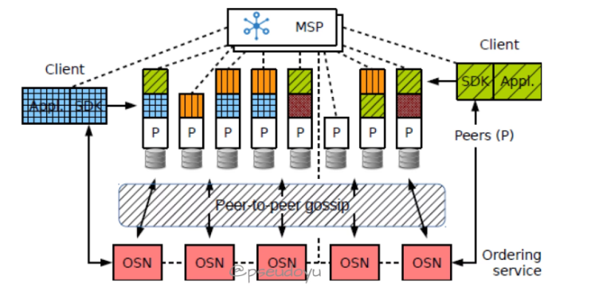
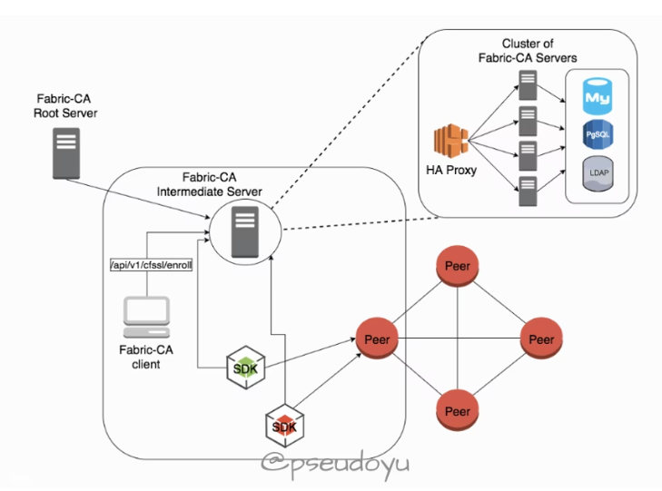
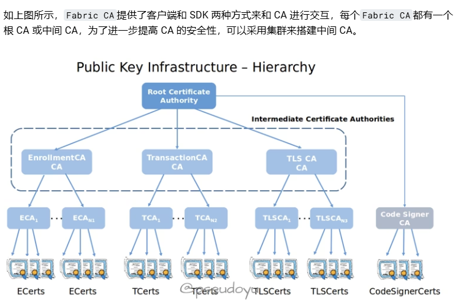
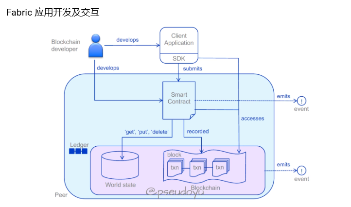
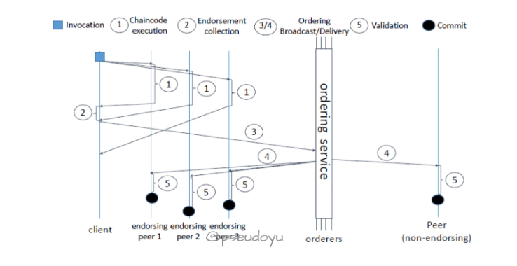
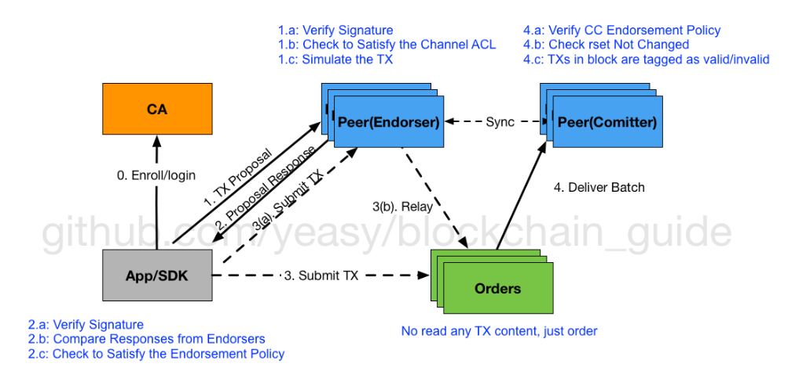

Hyperledger有如下几个核心设计理念：

它针对企业具体的业务场景提升效率，并且对溯源等场景有着独特优势，每个企业都可以针对自己的场景维护独立的Hyperledger项目，因此，它不需要像公链一样通过数字货币来激励用户参与区块链系统。
企业的应用场景较为复杂，往往 Hyperledger 只是在其中参与了某个或某些环节，因此与其他现有系统的交互必不可少，因此 Hyperledger 在设计上注重配备完整的 API 以供其他系统调用与交互。
Hyperledger的框架结构是模块化、可拓展，企业可以根据具体的业务需求选择不同的模块，避免复杂的业务逻辑和臃肿的系统。
企业应用的安全性是重中之重，尤其是许多应用场景牵扯到高价值交易或敏感数据，因此提供了很多机制来保障安全性（如Fabric的通道机制等）
除了与现有的系统交互外，企业未来的区块链应用中还可能会和很多不同的区块链网络进行交互，因此大部分智能合约/应用应该具备跨区块链网络的可移植性，以形成更复杂和强大的网络。

而Fabric采用了Execute - Order - Validate - Update State架构。

hyperledger_fabric_architecture

收到一笔新的交易后，首先提交至背书节点本地模拟交易执行（并背书），再将已背书交易排序并广播，各个节点对交易进行验证后更新状态。

正如上述联盟链特性中所述，Fabric网络的加入需要得到许可（身份验证），Fabric网路中的每个节点都有自己的身份。

总的来说，Fabric通过模块化、可插拔的架构来支持企业的复杂业务场景，通过身份验证（绑定现实身份）来弱化节点作恶，使用通道机制大大提升了系统的安全性和隐私保护。

MSP 成员服务提供商 #
那么，参与Fabric网络的身份是怎样管理的呢？

Fabric有一个 MSP(Membership Service Provider)成员管理提供商，它主要用来管理 CA 证书来验证哪些成员是可信任的。Fabric CA模块是独立的，可以管理证书服务，也可以允许第三方 CA 的接入，大大拓展的系统的应用范围。

更具体一点看 CA 的层级体系，一般是采用根 CA、业务 CA 和用户 CA 三层树结构，所有的下层 CA 会继承上层 CA 的信任体系。根 CA 用来签发业务 CA，业务 CA 用来签发具体的用户 CA（身份认证 CA、交易签名、安全通讯 CA 等）

通道 #
上文提到Fabric用 Channel 通道机制来保障交易的安全和隐私性，本质上每一个通道就是一个独立的账本，也是一个独立的区块链，有着不同的世界状态，网络中的一个节点可以同时加入多个通道。这种机制可以很好地划分不同的业务场景，也不用担心交易信息泄漏问题。

链码 #
Fabric也有类似以太坊的智能合约，称为 Chaincode 链码，智能合约使外部的应用程序可以和Fabric网络中的账本进行交互。不同于Ethereum，Fabric使用 Docker 而不是特定的虚拟机来存放链码，提供了一个安全、轻便的语言执行环境。

链码主要分成系统链码和用户链码两种，系统链码嵌入在系统内，提供对系统进行配置、管理的支持；而用户链码则是运行在单独的 Docker 容器中，提供对上层应用的支持，用户通过链码相关的 API 编写用户链码，即可对账本中状态进行更新操作。

链码经过安装和实例化操作后即可被调用，在安装的时候需要指定具体安装到哪个 Peer 节点（有的节点可以没有链码），实例化时还需要指定通道及背书策略。

链码之间也可以相互调用，从而创建更灵活的应用逻辑。

共识机制 #
Fabric中广义的共识机制包括背书、排序和验证三个环节，狭义的共识是指排序，

Fabric区块链网络中，不同参与者之间交易必须按照发生的顺序写到分布式账本中，依赖共识机制，主要有三种：

SOLO（只限于开发）
Kafka（一种消息平台）
Raft（相比 Kafka 更中心化）
网络协议 #
那Fabric网络中各个节点的状态分发又是怎么进行的呢？

外界的客户端是通过gRPC来对Fabric网络中的各个节点进行远程调用，而P2P网络中各个节点之间的同步是通过Gossip协议来进行的。

Gossip协议主要是用于网络中多个节点之间的数据交换，比较容易实现且容错率很高，原理就是数据发送一方从网络中随机选取若干个节点发送过去，等几个节点接收到这些数据后再随机发送给除了发送方外的若干节点，不断重复，最终所有节点达成一致（复杂度为 LogN）。

分布式账本 #
最终所有的交易都会记录到分布式账本中，这也是区块链诸多特性的核心。Fabric中交易可以存储相关业务信息，区块是一组排列后的交易集合，将区块通过密码算法链接起来就是区块链。分布式账本主要记录世界状态（最新的分布式账本状态，一般使用CouchDB以方便查询）和事务日志（世界状态的更新历史，记录区块链结构，使用LevelDB），对账本的每个操作都会记录在日志中，不可篡改。

应用编程接口 #
对于基于Fabric的应用，则主要提供了 SDK 开发工具包和 CLI 命令行两种方式进行交互。

Fabric 区块链核心角色 #
首先要提的是Fabric网络中的角色都是逻辑角色，比如 Peer 节点 A 可能既是排序节点，也可能在某些业务中是背书节点，而一个角色也不仅仅由单一节点担任。

接下来介绍一下各个角色的作用和职能。

Clients 客户端主要给交易签名，提交交易 Proposal 给背书节点，接收已经背书后的交易广播给排序节点；背书节点则是本地模拟执行交易 Proposal 验证交易（策略由 Chaincode 制定），签名并返回已背书交易；排序节点则将交易打包为 block 然后广播至各个节点，不参与交易的执行和验证，多个排序节点可以组成 OSN；所有的节点都维护区块链账本。

优势总结 #
Fabric通过将企业应用的各个复杂环节分配到各个逻辑角色节点（背书、排序等），不需要所有节点都承担如排序这样资源消耗较大的操作，消除了网络瓶颈；分配了角色后某些交易只在特定的节点部署和执行，且可以并发执行，大大提升效率和安全性，也隐藏了一些商业逻辑；因此，可以根据不同的业务需要来形成多种灵活的分配方案，极大增强了系统的拓展性。

将共识机制、权限管理、加密机制、账本等模块都设置为可插拔，且不同的链码可以设置不同的背书策略，信任机制更加灵活，这样可以根据业务需要设置自己的高效系统。

成员身份管理的Fabric CA作为单独的项目，能够提供更多功能，也能够与很多第三方 CA 直接进行接入和交互，功能更强大，适合企业复杂的场景。

多通道的特性是不同通道之间的数据彼此隔离，提高了安全性和隐私保护。

链码支持如Java、Go、Node等不同的编程语言，更加灵活，也支持更多第三方拓展应用，降低了业务迁移和维护成本。

上图就是作为一个区块链开发者在应用Fabric区块链中的开发和交互流程。

开发者主要负责开发应用和智能合约（链码），应用通过 SDK 与智能合约进行交互，而智能合约的逻辑可以对账本进行get、put、delete等操作。

### 身份角色
1. 简介
区块链作为一种分布式账本技术，主要分为许可链和非许可链。其中许可链又分为私有链和联盟链。和BTC或ETH 不同，联盟链是一种需要身份认证的区块链。只有通过认证的节点或组织才能参与联盟链网络中的交易。

2. Hyperledger fabric
Hyperledger fabric是一种联盟链。fabric网络中的成员都需要在可信赖的成员服务提供者处注册，否则不能参与交易。/*因此围绕联盟链产生了一些争议，一些人认为以fabric为代表的联盟链并不是真正的区块链，而另一些人则持反对意见。*/

fabric有一个特有的功能，通道（channel）。通道中的成员与通道外的成员的相互隔绝的，只有同一个通道的成员能够共享账本，不同通道的成员之间的交易记录是不可互相查询的。值得一提的是，同一个节点可以加入不同的通道。

fabric的共识机制是可以拔插的。共识机制是一个分布式系统里的名词，就是在不同的系统中并保持副本的一致性。fabric允许网络中的节点自行选择最能代表参与者需求的共识机制。

fabric中的账本系统包括两个组件：世界状态（数据库）和交易日志（历史记录）。每个参与者都拥有他们所属的fabric网络的账本副本。世界状态描述了账本在给定时间点的状态。它是账本的数据库，记录了当前状态的所有交易，是世界状态的更新历史。交易日志是不可插拔的，它只记录区块链网络中使用账本数据库前后的值。

3. Fabric的身份
身份是联盟链区别与公链的一个最重要特征。在公链中是没有身份这个概念的，每个节点都是相同的角色。而fabric身份是联盟链中最重要的概念，甚至可以没有之一。联盟链中的身份确定了对资源的确切权限以及对参与者在区块链网络中拥有的信息的访问权限。

整个网络中分为几种角色：peer节点（提交节点和背书节点），证书颁发机构CA，其中成员服务提供者（Membership Service Provider, MSP）是一个可信任的权威机构，它不是fabric中的角色，但是为fabric中的节点提供可信的身份认证。fabric中，默认的MSP实现使用X.509证书（使用最广泛的证书结构标准，包括证书信息/签名算法/数字签名等内容）作为身份，采用公钥基础结构（Pubic Key Infrastructure, PKI）作为分层模型。PKI 是身份供应商，为接入区块链网络的用户提供一个身份列表，用户的身份只能在身份列表的包含范围内选择；而MSP是接受身份供应商，会提供一个列表来确定哪些身份是可信的成员（也就是参与者）。

4. 公钥基础结构（Pubic Key Infrastructure, PKI）
PKI 有四个关键要素：数字证书/公钥私钥/证书颁发机构和证书撤销列表：

数字证书包含了证书持有者（区块链网络参与者）的相关属性，其中最常见的证书类型就是X.509标准。最关键的是，证书持有者的公钥会在其证书中分发。数字签名可以验证消息的来源以及消息的完整性。

公钥私钥的作用是为了验证数字签名（如Fig 1），这里用到了我们常说的非对称加密。密钥之间唯一的数学关系使得私钥在消息上的签名只有对应的公钥在相同的消息上才能匹配。参与者用私钥加密，而任何持有其公钥的用户都可以查看签名消息并验证签名。其中的公钥是每一个节点都可以使用的，用于充当授权锚；私钥被用在消息中产生数字签名。消息的接收者可以通过其所持有的发送者的公钥来验证数字签名的有效性，进而验证消息的来源和完整性。

Fig 1 数字签名

证书颁发机构（Certificate Authority，CA）

CA是一个区块链网络信任的权威机构，它可以向参与者或者节点颁发经过加密验证的数字证书。CA向不同的参与者颁发证书，并对这些证书进行签名，将参与者的公钥绑定上去（可以选择包含参与者全部属性的列表）。区块链网络中的成员信任CA（并知道CA的公钥），则可以信任经过CA认证的证书，并通过验证CA的签名来获得签名中包含的所有属性。数字证书可以作为信任锚，来验证不同参与者的消息。区块链网络中可以存在一个或多个CA。

CA分为根CA和中间CA，它们构成了一条信任链。根CA能够给整个网络中的用户颁发证书，中间CA的证书直接或间接地由根CA颁发，可以有隐藏和保护根CA的作用。

Fabric CA是一个内置的CA组建，用来给fabric网络充当根CA，提供和管理证书。

证书吊销列表（Certificate Revocation Lists，CRL）是一个被吊销证书的黑名单，CRL 上的证书都将被视为无效。

5. 成员服务提供者（Membership Service Provider， MSP）
PKI 解决了fabric网络中身份发放的问题，但由于节点的私钥永远都不会公开，因此还需要引入一种可以证实身份的机制 MSP 。

MSP 是一组被添加在网络中的配置文件夹，被用来在外部和内部定义组织（organization）。CA生成代表身份的证书，而MSP包含了被许可身份的列表。MSP 通过识别成员或向成员颁发身份的CA，来确定是否接受它们作为信任域的成员。MSP 通过标志参与者在节点或通道中的特定权利，将身份转化为角色。简而言之，PKI（具体说是CA）提供的是身份；而MSP提供的是角色。

当用户使用Fabric CA注册时，其必须关联为管理员/peer节点/客户端/排序节点/成员其中之一的角色。MSP 根据作用范围的不同分为：本地MSP和通道MSP。本地MSP为客户端/peer节点/排序节点定义，每一个节点都必须定义一个本地MSP。通道MSP则在通道层面定义了管理权和参与权，在通道中分配成员的权限，每一个参与通道的组织都要为自己定义一个通道MSP。

因此，MSP 是一种能使参与者加入联盟链的机制，想要在Fabric网络上进行交易需要：

1.拥有一个CA颁发的身份；2.成为一个被网络中的成员认可的组织成员（将成员的公钥添加到组织的MSP中即可）；3.将MSP添加到一个网络中的联盟或通道中；4.确保MSP包含在网络所定义的策略（Policy）中。

6. 策略（Policy）
在Fabric中，策略是基础设施的管理机制。它表示了成员如何同意或拒绝网络/通道/智能合约的更改。策略是在区块链网络最初配置时由联盟成员一致同意的，但在网络演化的过程中可以更改。简而言之，在区块链网络中的所有行为都要受到策略的控制。

策略是Fabirc区别于公链的内容之一。在公链中，交易可以在网络中的任意节点中生成和验证，但是Fabric是许可链的一种，因此策略决定了哪些组织可以访问或更新Fabric网络，并且提供了强制执行这些决策的机制。从这个角度看，我认为Fabric的可监管性更强。

策略在Fabric网络的不同层级中都有应用。至于具体应用和访问控制列表（Access Control List，ACL）就放在后面再学了，这部分我感觉更偏向与工程实践。

另外专门说两个我认为比较关键的策略：背书策略（Endorsement policy）定义了必须为执行提案背书的组织；修改策略（Modification policy）指定了任何配置更新所需要的一组身份，是更新策略的策略，每一个通道配置中都包含一个对修改策略的引用。

7. Peer节点
这一个部分我认为是和身份与角色相辅相成的，角色和身份就是为了peer节点组成的区块链网络服务的。但是peer可学的太多了，我放到后面。
### Fabric 工作流程 #

    接下来通过一个完整的交易流来梳理一下Fabric网络的工作原理

在所有操作之前，需要向 CA 获取合法身份并且指定通道
首先，Client 提交交易 Proposal（含自己的签名）至背书节点
背书节点接收到交易 Proposal 后用本地状态模拟执行，对交易进行背书、签名并返回（其中包含 Read-Write Set、签名等）
Client 收集到足够的背书后（策略由 Chaincode 制定，如图中示例为得到 2 个背书）提交已背书交易至排序节点（OSN）
排序节点将交易打包成 blocks，排序（不执行或验证交易正确性）并广播至所有节点
所有节点对新 blocks 进行验证并提交至账本
接下来对每个环节进行一些详细的拆解

执行/背书环节 #
Client 提交交易 proposal 后，背书节点会首先核对 Client 的签名，用本地状态模拟执行，对交易进行签名和 Read-Write Set 回 Clients，R-W Sets 主要包含key, version, value三个属性，Read-Set 包含交易执行中读取的所有变量和其version，对账本进行 write 操作的话version会产生变化，Write-Set 包含所有被编辑的变量及其新值。

背书节点在执行交易时值根据本地区块链的状态检查链码是否正确，执行并返回。

Fabric 支持多种背书策略，Client 在提交至排序节点前会验证是否满足背书要求，值得注意的是如果只做了查询账本操作，Client 不会提交至 OSN。

上文所提到的交易 proposal 主要包括链码、链码的输入值、Client 的签名，而背书节点返回至 Client 的信息则包括返回值、模拟执行结果的 R-W Set 以及背书节点的签名，组合起来则是已背书节点。

背书是相关组织对交易的认可，即相关节点对交易进行签名。对于一个链码交易来说，背书策略是在链码实例化的时候指定的，一笔有效交易必须是背书策略相关组织签名才能生效，本质上Fabric区块链中的交易验证是基于对背书节点的信任，这也是称Fabric并不是严格意义上的去中心化的原因之一。

以下是一个简单的链码执行示例

func (t *SimpleChaincode) InitLedger(ctx contractapi.TransactionContextInterface) error {
    var product = Product { Name: "Test Product", Description: "Just a test product to make sure chaincode is running", CreatedBy: "admin", ProductId: "1" }

    productAsBytes, err := json.Marshal(product)

    err = ctx.GetStub().PutState("1", productAsBytes)

    if err != nil {
        return err
    }
}
排序环节 #
Client 提交已背书交易至排序节点（排序节点可通过一些共识策略组成 OSN），排序节点接收到交易后，会打包成 blocks 并按照配置中的规则进行排序，在此过程中，只执行排序操作，而不进行任何执行或验证，排序完成后发送至所有节点。

排序服务用来对全网交易达成一致，只负责对交易顺序达成一致，避免了整个网络瓶颈，更容易横向拓展以提升网络效率，目前支持Kafka和Raft两种，Fabric区块链网络的统一/完整性依赖于排序节点的一致性。

Raft 共识机制属于非拜占庭共识机制，使用了领导者和跟随者（Leader 和 Follower）模型，当一个 Leader 被选出，日志信息会从 Leader 向 Follower 单向复制，更容易管理，在设计上允许所有节点都可以称为 Orderer 节点，相比 Kafka 更中心化，其实也允许采用 PBFT 共识机制，但是性能往往很差。

验证环节 #
当节点接收到由排序节点发送来的区块时，会对区块中的所有交易进行验证并标记是否可信，主要验证两个方面：1.是否满足背书策略。2.交易结构的合法性，是否有状态冲突，如 Read-Set 中的version是否一致等。

### fabric总结
联盟链的一个发展方面。   以权限为代表，贯穿整个系统的生命周期
对节点权限的校验。   
CA（证书颁发机构）：
节点需要通过Fabric CA（Certificate Authority）进行身份认证和注册。
节点管理员需要向CA申请注册，获取一个身份证书（Identity Certificate）。
MSP（成员服务提供者）：
每个节点都需要配置一个MSP，MSP定义了节点的身份和权限。
MSP包含证书链、管理员证书、用户证书等信息。

### 在共识网络内建立自己的世界状态。
管理员权限：
节点管理员需要具备足够的权限来配置和管理节点。
管理员权限通常包括创建和管理身份、加入通道、更新通道配置等。
策略（Policies）：
Fabric网络中的许多操作都受策略控制，如加入通道、提交交易、背书等。
节点需要符合相应的策略要求，才能执行特定的操作。

## fabric 的节点类型
Peer节点：
Peer节点负责执行智能合约（链码）、维护账本和参与共识。
加入网络的Peer节点需要安装和实例化所需的链码，并加入相应的通道。
Orderer节点：
Orderer节点负责交易排序和区块生成。
加入网络的Orderer节点需要配置到网络的排序服务中，并遵循网络的共识机制。

## fabric数据库
用途：用于存储世界状态（World State），即最新的账本状态。
特点：
LevelDB：是一个简单的键值存储数据库，适用于基本的键值对存储。
RocksDB：是一个高性能的嵌入式键值存储数据库，通常比LevelDB更快，更适合处理大规模数据。
默认选择：Fabric 默认使用 LevelDB 作为世界状态存储。
适用场景：适用于不需要复杂查询的简单应用。
2. CouchDB
用途：用于存储世界状态，并支持富查询（Rich Query）。
特点：
文档数据库：CouchDB 是一个文档数据库，支持 JSON 格式的数据存储。
富查询：CouchDB 支持复杂的查询，如范围查询、排序、分页等。
索引：可以为字段创建索引，提高查询性能。
配置：需要在启动Peer节点时明确指定使用CouchDB。
适用场景：适用于需要复杂查询和数据管理的应用。
配置选择

## fabric 架构思考
目前的架构：
底层资源，网络，计算，存储都是通过k8s以及docker整合
数据库选用1. LevelDB 或 RocksDB
以go项目启动的pod提供api，最后整合成大的service服务

在原生的fabric服务上，百度的baas平台。接口是通过整合k8s和fabric的sdk，提供api服务。
这里的数据库选用mysql，中间层用了kafka，redis

内部有一个基础的前端界面，但是不太行。是百度低代码平台搭建的。2017的代码。
对外部卖是主要以后端pod，一键部署k8s平台售卖。

### fabric交易，以及构造交易参数

1. 交易请求参数
Chaincode ID: 这是链码的唯一标识符，用于指明要调用哪个链码。
Function Name: 链码函数的名字，表示要执行的具体逻辑。
Arguments: 函数的输入参数，用于传递给链码函数的实际数据。
例如，一个交易请求可能看起来像这样：

json
深色版本
{
  "chaincode_id": "mycc",
  "function_name": "transfer",
  "arguments": ["from", "to", "amount"]
}
2. 签名
Signature: 每个交易请求必须由发起方签署，以证明该交易是由合法实体发出的。签名基于交易请求的内容以及发起者的私钥。
3. 背书策略
Endorsement Policy: 交易需要满足的背书策略，这决定了多少个节点需要同意这个交易才被认为是有效的。例如，可能是“至少两个节点”或者“所有的节点”。
4. 通道名称
Channel Name: 交易发生的通道名称，因为不同的通道有不同的账本和链码环境。
5. 事务ID
Transaction ID: 唯一标识此次交易的ID，用于跟踪和防止重复交易。
6. 时间戳
Timestamp: 表示交易发生的时间，用于排序和防篡改。
7. 事件监听器
Event Listener: 可选的，用于接收交易完成后产生的事件通知

#### fabric交易参数
交易中包括的内容主要有：

交易类型：目前包括 Deploy、Invoke、Query、Terminate 四种；
uuid：代表交易的唯一编号；
链码编号 chaincodeID：交易针对的链码；
负载内容的 hash 值：Deploy 或 Invoke 时候可以指定负载内容；
交易的保密等级 ConfidentialityLevel；
交易相关的 metadata 信息；
临时生成值 nonce：跟安全机制相关；
交易者的证书信息 cert；
签名信息 signature；
metadata 信息；
时间戳 timestamp。

#### 区块
区块打包交易，确认交易后的世界状态。

一个区块中包括的内容主要有：

版本号 version：协议的版本信息；
时间戳 timestamp：由区块提议者设定；
交易信息的默克尔树的根 hash 值：由区块所包括的交易构成；
世界观的默克尔树的根 hash 值：由交易发生后整个世界的状态值构成；
前一个区块的 hash 值：构成链所必须；
共识相关的元数据：可选值；
非 hash 数据：不参与 hash 过程，各个 peer 上的值可能不同，例如本地提交时间、交易处理的返回值等；

#### 世界状态
世界观用于存放链码执行过程中涉及到的状态变量，是一个键值数据库。典型的元素为 [chaincodeID, ckey]: value 结构。

为了方便计算变更后的 hash 值，一般采用默克尔树数据结构进行存储。树的结构由两个参数（numBuckets 和 maxGroupingAtEachLevel）来进行初始配置，并由 hashFunction 配置决定存放键值到叶子节点的方式。显然，各个节点必须保持相同的配置，并且启动后一般不建议变动。

numBuckets：叶子节点的个数，每个叶子节点是一个桶（bucket），所有的键值被 hashFunction 散列分散到各个桶，决定树的宽度；
maxGroupingAtEachLevel：决定每个节点由多少个子节点的 hash 值构成，决定树的深度。
其中，桶的内容由它所保存到键值先按照 chaincodeID 聚合，再按照升序方式组成。

一般地，假设某桶中包括 M 个 chaincodeID，对于 chaincodeID_i ，假设其包括 N 个键值对，则聚合 G_i 内容可以计算为：

Gi = Len(chaincodeID_i) + chaincodeID_i + N + \sum{1}^{N} {len(key_j) + key_j + len(value_j) + value_j}

该桶的内容则为

bucket = \sum_{1}^{M} G_i

注：这里的 + 代表字符串拼接，并非数学运算。

#### 链码服务
链码包含所有的处理逻辑，并对外提供接口，外部通过调用链码接口来改变世界观。

接口和操作
链码需要实现 Chaincode 接口，以被 VP 节点调用。

type Chaincode interface { Init(stub *ChaincodeStub, function string, args []string) ([]byte, error) Invoke(stub *ChaincodeStub, function string, args []string) ([]byte, error) Query(stub *ChaincodeStub, function string, args []string) ([]byte, error)}
链码目前支持的交易类型包括：部署（Deploy）、调用（Invoke）和查询（Query）。

部署：VP 节点利用链码创建沙盒，沙盒启动后，处理 protobuf 协议的 shim 层一次性发送包含 ChaincodeID 信息的 REGISTER 消息给 VP 节点，进行注册，注册完成后，VP 节点通过 gRPC 传递参数并调用链码 Init 函数完成初始化；
调用：VP 节点发送 TRANSACTION 消息给链码沙盒的 shim 层，shim 层用传过来的参数调用链码的 Invoke 函数完成调用；
查询：VP 节点发送 QUERY 消息给链码沙盒的 shim 层，shim 层用传过来的参数调用链码的 Query 函数完成查询。
不同链码之间可能互相调用和查询。

## fabric架构图

客户端：客户端应用使用 SDK 来跟 Fabric 打交道，构造合法的交易提案提交给 endorser；收集到足够多 endorser 支持后可以构造合法的交易请求，发给 orderer 或代理节点。
Endorser peer：负责对来自客户端的交易进行合法性和 ACL 权限检查（模拟交易），通过则签名并返回结果给客户端。
Committer peer：负责维护账本，将达成一致顺序的批量交易结果进行状态检查，生成区块，执行合法的交易，并写入账本，同一个物理节点可以同时担任 endorser 和 committer 的 角色。
Orderer：仅负责排序，给交易们一个全局的排序，一般不需要跟账本和交易内容打交道。
CA：负责所有证书的维护，遵循 PKI。

## 场景模拟
浦发总部有机器，构建一个fabric网络。如果对内使用，不同机器部署fabric服务。在这个基础上创建联盟链，并且新建组织。
每个组织可以绑定peer节点，以后通过此组织调用的链码，都是此节点签名。

msp给有权限在通道内的成员授权。

但是颁发的证书是大量的，类似于网站的数量。所以这种不太能支持个人直接使用。每一次的交互是和指定的网站或者说某个组织交互。

提出支持个人。所以有钱包模块的一些需求。

did模块

did身份码对应did文档，文档内有公钥

